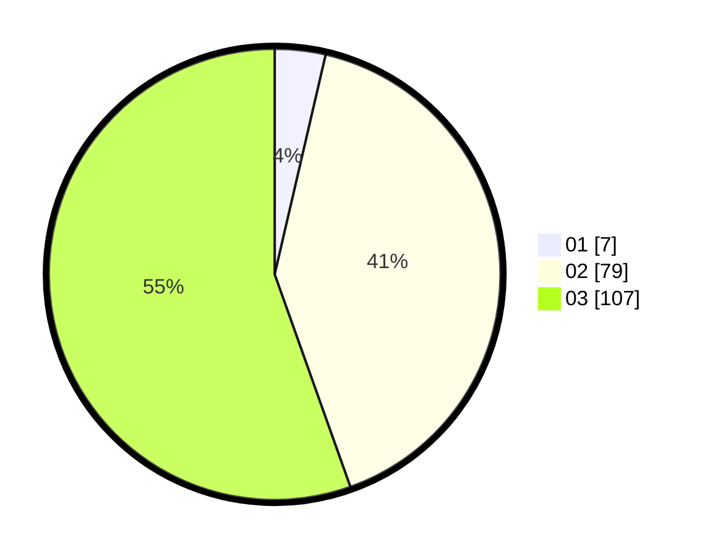

# Hasil

Hasil perolehan suara paslon dapat dilihat pada file paslon-01.txt, paslon-02.txt, dan paslon-03.txt.

Jika tidak ada, artinya data tersebut belum ada pada SIREKAP.

## Perolehan Suara

 * Paslon 01: **7**.
 * Paslon 02: **79**.
 * Paslon 03: **107**.

## Foto C Plano

https://sirekap-obj-formc.kpu.go.id/a963/pemilu/ppwp/31/73/05/10/05/3173051005150-20240214-232240--99187dfc-b4cf-4436-9477-9809557b0fff.jpg

https://sirekap-obj-formc.kpu.go.id/a963/pemilu/ppwp/31/73/05/10/05/3173051005150-20240214-232327--a19247e9-ab1b-404c-91c8-8e6f5b8b6334.jpg

https://sirekap-obj-formc.kpu.go.id/a963/pemilu/ppwp/31/73/05/10/05/3173051005150-20240214-232517--7911842b-6051-4b80-bcbd-f34712aa907a.jpg
