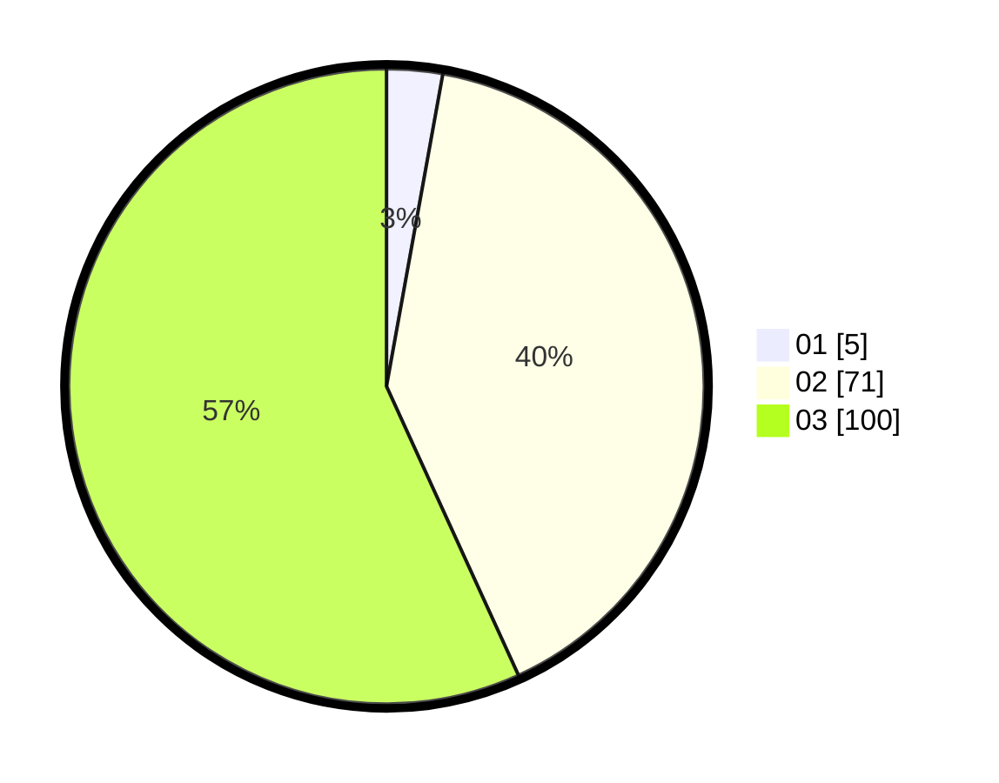

# Hasil

Hasil perolehan suara paslon dapat dilihat pada file paslon-01.txt, paslon-02.txt, dan paslon-03.txt.

Jika tidak ada, artinya data tersebut belum ada pada SIREKAP.

## Perolehan Suara

 * Paslon 01: **5**.
 * Paslon 02: **71**.
 * Paslon 03: **100**.

## Foto C Plano

https://sirekap-obj-formc.kpu.go.id/8693/pemilu/ppwp/31/73/05/10/05/3173051005154-20240214-200029--4344550e-6d28-416a-a78b-752f61b5fabe.jpg

https://sirekap-obj-formc.kpu.go.id/8693/pemilu/ppwp/31/73/05/10/05/3173051005154-20240214-200155--9ac18a75-f101-4124-a06a-4268ba2df216.jpg

https://sirekap-obj-formc.kpu.go.id/8693/pemilu/ppwp/31/73/05/10/05/3173051005154-20240214-200258--8317cfc2-1bc8-4200-8242-2048da28bd00.jpg
