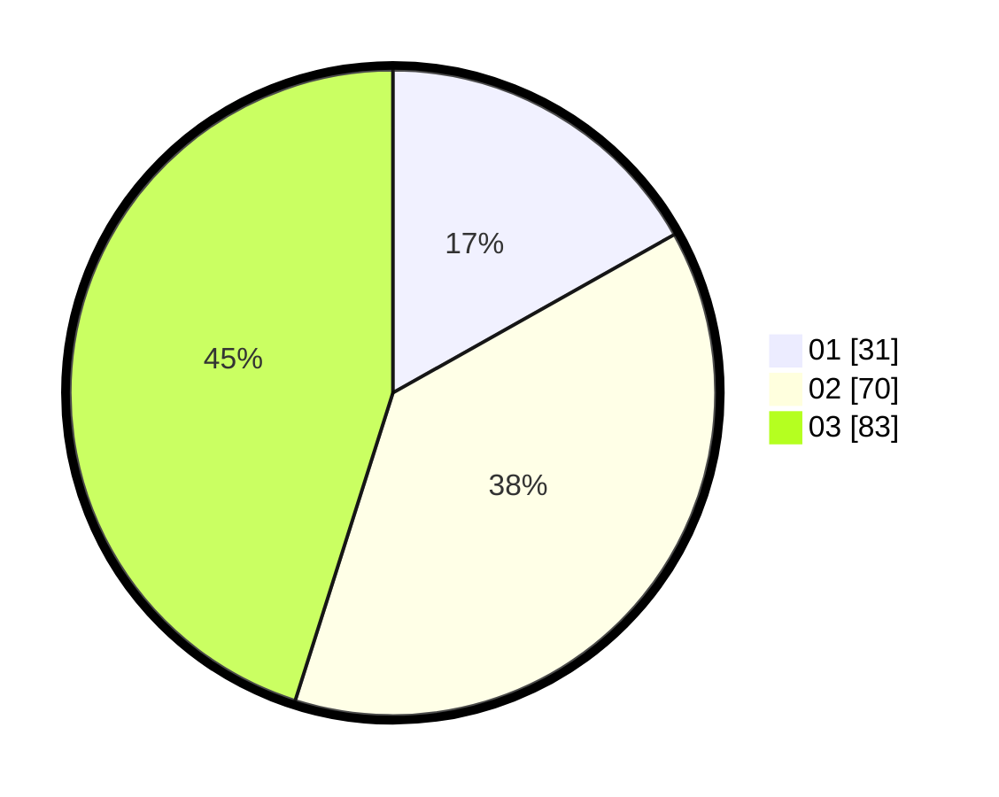

# Hasil

Hasil perolehan suara paslon dapat dilihat pada file paslon-01.txt, paslon-02.txt, dan paslon-03.txt.

Jika tidak ada, artinya data tersebut belum ada pada SIREKAP.

## Perolehan Suara

 * Paslon 01: **31**.
 * Paslon 02: **70**.
 * Paslon 03: **83**.

## Foto C Plano

https://sirekap-obj-formc.kpu.go.id/66b0/pemilu/ppwp/31/73/05/10/05/3173051005157-20240214-155108--543dab83-d297-4fc2-b25f-919145f65793.jpg

https://sirekap-obj-formc.kpu.go.id/66b0/pemilu/ppwp/31/73/05/10/05/3173051005157-20240214-155550--e7dda2e2-8e7a-496e-a083-c4c77b5756e1.jpg

https://sirekap-obj-formc.kpu.go.id/66b0/pemilu/ppwp/31/73/05/10/05/3173051005157-20240214-155827--ef708715-0582-4430-8e9b-b5095ed06d6b.jpg
