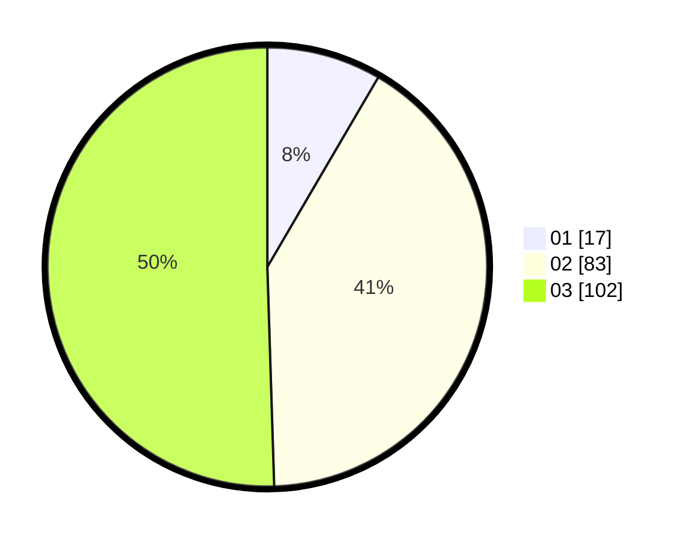

# Hasil

Hasil perolehan suara paslon dapat dilihat pada file paslon-01.txt, paslon-02.txt, dan paslon-03.txt.

Jika tidak ada, artinya data tersebut belum ada pada SIREKAP.

## Perolehan Suara

 * Paslon 01: **17**.
 * Paslon 02: **83**.
 * Paslon 03: **102**.

## Foto C Plano

https://sirekap-obj-formc.kpu.go.id/fb0d/pemilu/ppwp/31/73/05/10/05/3173051005159-20240215-022526--36c805e4-21cb-4f3b-b52c-745d6bb90880.jpg

https://sirekap-obj-formc.kpu.go.id/fb0d/pemilu/ppwp/31/73/05/10/05/3173051005159-20240215-022530--ee6e62cc-d603-4d85-893f-48c6b7c75710.jpg

https://sirekap-obj-formc.kpu.go.id/fb0d/pemilu/ppwp/31/73/05/10/05/3173051005159-20240215-022534--8339cc0a-a13f-444f-84ea-c9b130a6e905.jpg
