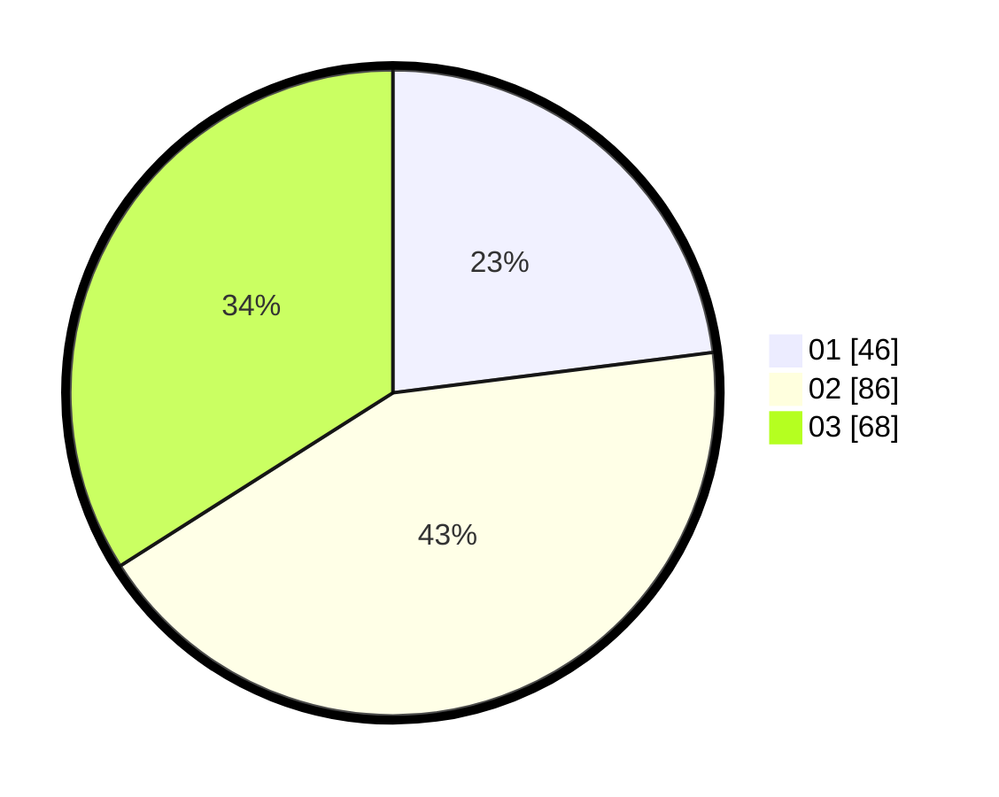

# Hasil

Hasil perolehan suara paslon dapat dilihat pada file paslon-01.txt, paslon-02.txt, dan paslon-03.txt.

Jika tidak ada, artinya data tersebut belum ada pada SIREKAP.

## Perolehan Suara

 * Paslon 01: **46**.
 * Paslon 02: **86**.
 * Paslon 03: **68**.

## Foto C Plano

https://sirekap-obj-formc.kpu.go.id/283b/pemilu/ppwp/31/73/05/10/05/3173051005162-20240215-030754--6c77dbcf-4964-4d7c-b101-77820fdde754.jpg

https://sirekap-obj-formc.kpu.go.id/283b/pemilu/ppwp/31/73/05/10/05/3173051005162-20240215-030801--454bcbd2-a695-4672-9fed-958d1609de85.jpg

https://sirekap-obj-formc.kpu.go.id/283b/pemilu/ppwp/31/73/05/10/05/3173051005162-20240215-030809--7da319fd-ad67-4ec0-acde-e7a213bad69a.jpg
