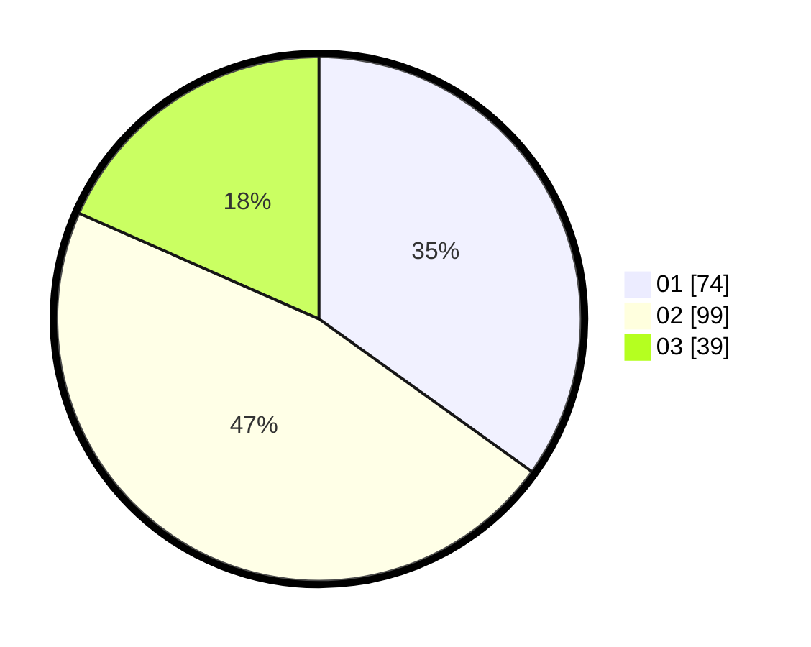

# Hasil

Hasil perolehan suara paslon dapat dilihat pada file paslon-01.txt, paslon-02.txt, dan paslon-03.txt.

Jika tidak ada, artinya data tersebut belum ada pada SIREKAP.

## Perolehan Suara

 * Paslon 01: **74**.
 * Paslon 02: **99**.
 * Paslon 03: **39**.

## Foto C Plano

https://sirekap-obj-formc.kpu.go.id/fde8/pemilu/ppwp/31/73/05/10/05/3173051005170-20240214-192921--c70928fd-2843-4496-b431-f1c02e7d008b.jpg

https://sirekap-obj-formc.kpu.go.id/fde8/pemilu/ppwp/31/73/05/10/05/3173051005170-20240214-193059--889f7733-bcbb-4e9d-a06e-5f70501c04ed.jpg
