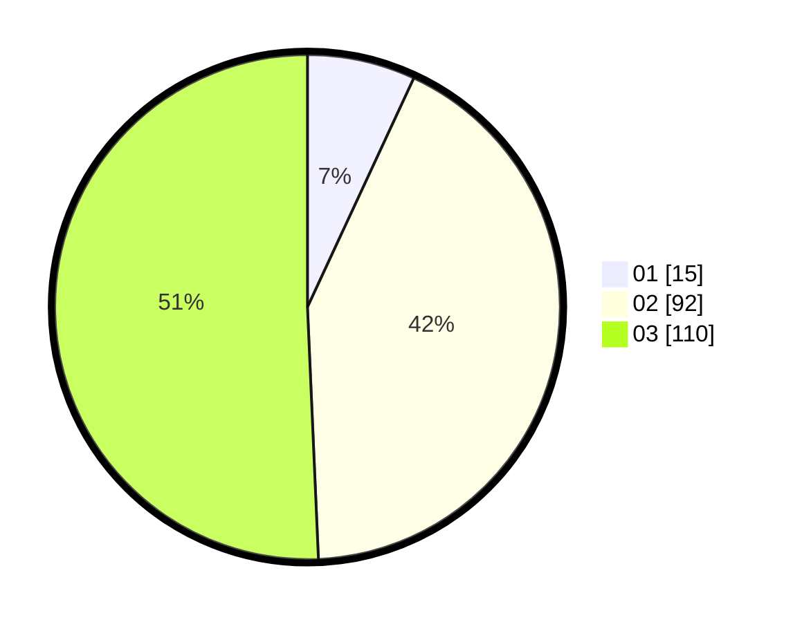

# Hasil

Hasil perolehan suara paslon dapat dilihat pada file paslon-01.txt, paslon-02.txt, dan paslon-03.txt.

Jika tidak ada, artinya data tersebut belum ada pada SIREKAP.

## Perolehan Suara

 * Paslon 01: **15**.
 * Paslon 02: **92**.
 * Paslon 03: **110**.

## Foto C Plano

https://sirekap-obj-formc.kpu.go.id/4d48/pemilu/ppwp/31/73/05/10/05/3173051005172-20240214-194357--591a1d7b-7db1-4b91-8019-6a68e6335810.jpg

https://sirekap-obj-formc.kpu.go.id/4d48/pemilu/ppwp/31/73/05/10/05/3173051005172-20240214-202222--5c3c8bd6-146e-4990-879a-e2d100ab0604.jpg

https://sirekap-obj-formc.kpu.go.id/4d48/pemilu/ppwp/31/73/05/10/05/3173051005172-20240214-155630--0c37b248-bd03-4126-bd3f-7cbba952ff66.jpg

## DATA PEMILIH TETAP

Jumlah pemilih dalam DPT: **269**.
 * L: **121**.
 * P: **148**.

## DATA PENGGUNA HAK PILIH

Jumlah pengguna hak pilih dalam DPT: **207**.
 * L: **92**.
 * P: **115**.

Jumlah pengguna hak pilih dalam DPTb: **4**.
 * L: **0**.
 * P: **4**.

Jumlah pengguna hak pilih dalam DPK: **7**.
 * L: **1**.
 * P: **6**.

Jumlah pengguna hak pilih: **218**.
 * L: **93**.
 * P: **125**.

## JUMLAH SUARA SAH DAN TIDAK SAH

JUMLAH SELURUH SUARA SAH: **217**.

JUMLAH SUARA TIDAK SAH: **1**.

JUMLAH SELURUH SUARA SAH DAN SUARA TIDAK SAH: **218**.
