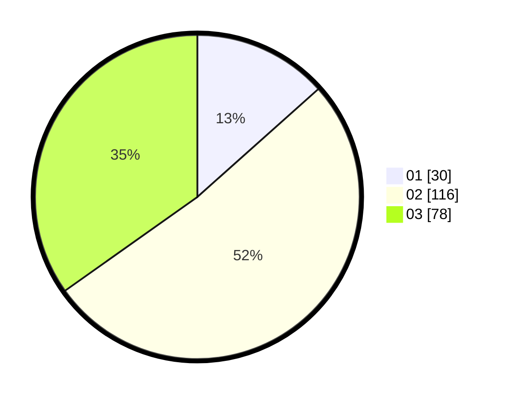

# Hasil

Hasil perolehan suara paslon dapat dilihat pada file paslon-01.txt, paslon-02.txt, dan paslon-03.txt.

Jika tidak ada, artinya data tersebut belum ada pada SIREKAP.

## Perolehan Suara

 * Paslon 01: **30**.
 * Paslon 02: **116**.
 * Paslon 03: **78**.

## Foto C Plano

https://sirekap-obj-formc.kpu.go.id/1bd1/pemilu/ppwp/31/73/05/10/05/3173051005173-20240214-222959--cd333db6-9381-45ed-984c-8060d22b081a.jpg

https://sirekap-obj-formc.kpu.go.id/1bd1/pemilu/ppwp/31/73/05/10/05/3173051005173-20240214-223139--4820312b-8c04-49be-b0ff-d9848691dddb.jpg

https://sirekap-obj-formc.kpu.go.id/1bd1/pemilu/ppwp/31/73/05/10/05/3173051005173-20240214-223251--c6b01e5c-69ff-4cd3-8f5d-a06901f55d9c.jpg

## DATA PEMILIH TETAP

Jumlah pemilih dalam DPT: **219**.
 * L: **209**.
 * P: **110**.

## DATA PENGGUNA HAK PILIH

Jumlah pengguna hak pilih dalam DPT: **219**.
 * L: **109**.
 * P: **110**.

Jumlah pengguna hak pilih dalam DPTb: **5**.
 * L: **2**.
 * P: **3**.

Jumlah pengguna hak pilih dalam DPK: **6**.
 * L: **3**.
 * P: **3**.

Jumlah pengguna hak pilih: **230**.
 * L: **114**.
 * P: **116**.

## JUMLAH SUARA SAH DAN TIDAK SAH

JUMLAH SELURUH SUARA SAH: **224**.

JUMLAH SUARA TIDAK SAH: **5**.

JUMLAH SELURUH SUARA SAH DAN SUARA TIDAK SAH: **229**.
