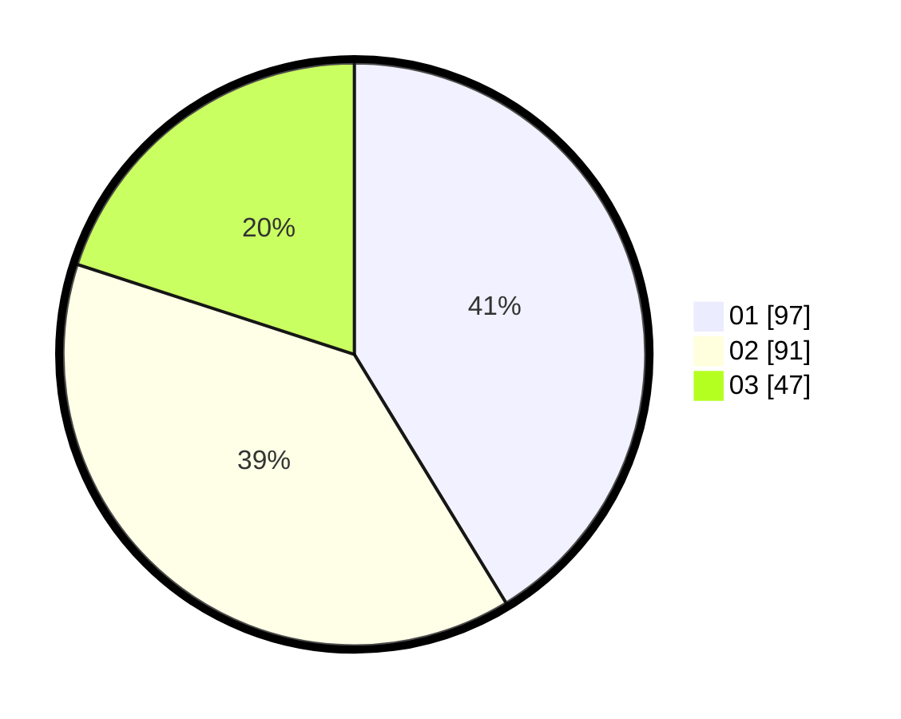

# Hasil

Hasil perolehan suara paslon dapat dilihat pada file paslon-01.txt, paslon-02.txt, dan paslon-03.txt.

Jika tidak ada, artinya data tersebut belum ada pada SIREKAP.

## Perolehan Suara

 * Paslon 01: **97**.
 * Paslon 02: **91**.
 * Paslon 03: **47**.

## Foto C Plano

https://sirekap-obj-formc.kpu.go.id/cdff/pemilu/ppwp/31/73/05/10/05/3173051005177-20240214-232551--d4c1313e-f697-417d-965e-18c57cba8106.jpg

https://sirekap-obj-formc.kpu.go.id/cdff/pemilu/ppwp/31/73/05/10/05/3173051005177-20240214-232635--bac35b1f-a696-4d41-8c58-1d735afa6451.jpg

https://sirekap-obj-formc.kpu.go.id/cdff/pemilu/ppwp/31/73/05/10/05/3173051005177-20240214-232742--047b66b7-6642-49fa-b643-52ef0347fc55.jpg
