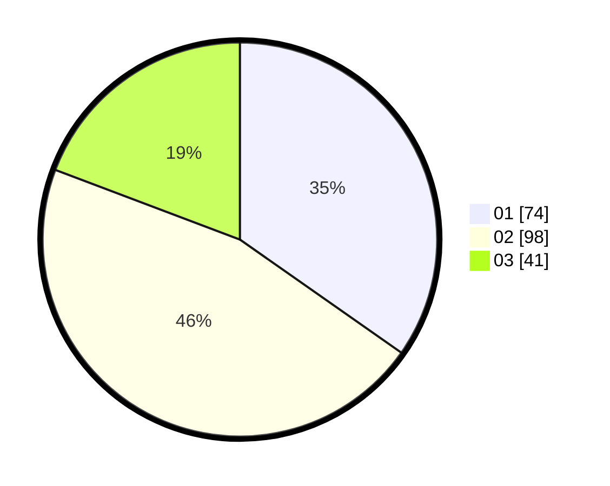

# Hasil

Hasil perolehan suara paslon dapat dilihat pada file paslon-01.txt, paslon-02.txt, dan paslon-03.txt.

Jika tidak ada, artinya data tersebut belum ada pada SIREKAP.

## Perolehan Suara

 * Paslon 01: **74**.
 * Paslon 02: **98**.
 * Paslon 03: **41**.

## Foto C Plano

https://sirekap-obj-formc.kpu.go.id/8c7f/pemilu/ppwp/31/73/05/10/05/3173051005178-20240214-220739--93eed1f3-a5a2-48e3-8a7b-e133fbeeb0c8.jpg

https://sirekap-obj-formc.kpu.go.id/8c7f/pemilu/ppwp/31/73/05/10/05/3173051005178-20240214-220835--7e22d60f-68fa-43dc-a8e8-b1c90329bb23.jpg

https://sirekap-obj-formc.kpu.go.id/8c7f/pemilu/ppwp/31/73/05/10/05/3173051005178-20240214-220942--01d3a105-c61e-4b19-9ec6-9fda75739c0c.jpg
