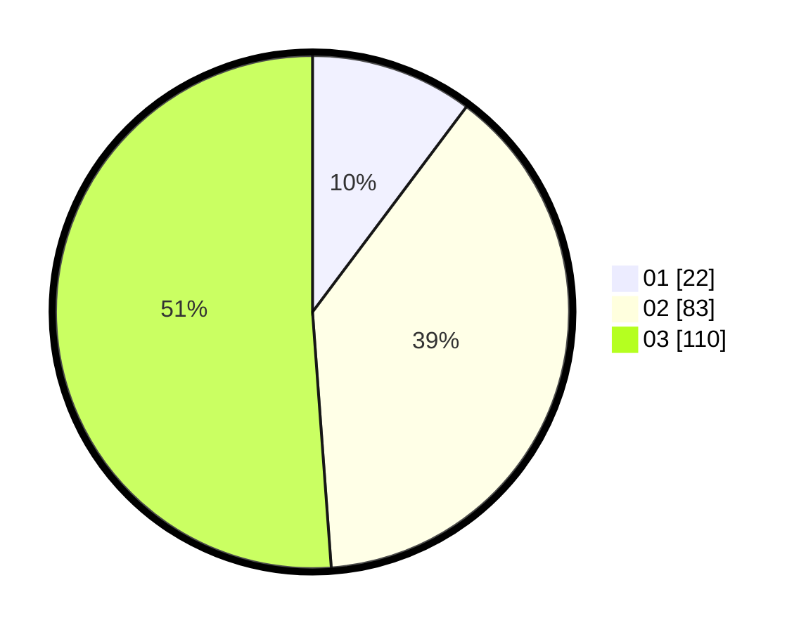

# Hasil

Hasil perolehan suara paslon dapat dilihat pada file paslon-01.txt, paslon-02.txt, dan paslon-03.txt.

Jika tidak ada, artinya data tersebut belum ada pada SIREKAP.

## Perolehan Suara

 * Paslon 01: **22**.
 * Paslon 02: **83**.
 * Paslon 03: **110**.

## Foto C Plano

https://sirekap-obj-formc.kpu.go.id/da29/pemilu/ppwp/31/73/05/10/05/3173051005181-20240214-193135--a7cc3eed-49a5-48d2-8adc-c921113fbb39.jpg

https://sirekap-obj-formc.kpu.go.id/da29/pemilu/ppwp/31/73/05/10/05/3173051005181-20240214-195154--154df6a1-e851-478a-abc4-a61a71e6ae9a.jpg

https://sirekap-obj-formc.kpu.go.id/da29/pemilu/ppwp/31/73/05/10/05/3173051005181-20240214-193417--6226e7d5-29a8-4276-bed3-c4c0ab3c73f6.jpg

## DATA PEMILIH TETAP

Jumlah pemilih dalam DPT: **279**.
 * L: **133**.
 * P: **146**.

## DATA PENGGUNA HAK PILIH

Jumlah pengguna hak pilih dalam DPT: **205**.
 * L: **97**.
 * P: **108**.

Jumlah pengguna hak pilih dalam DPTb: **4**.
 * L: **3**.
 * P: **1**.

Jumlah pengguna hak pilih dalam DPK: **9**.
 * L: **5**.
 * P: **4**.

Jumlah pengguna hak pilih: **218**.
 * L: **105**.
 * P: **113**.

## JUMLAH SUARA SAH DAN TIDAK SAH

JUMLAH SELURUH SUARA SAH: **215**.

JUMLAH SUARA TIDAK SAH: **3**.

JUMLAH SELURUH SUARA SAH DAN SUARA TIDAK SAH: **218**.
