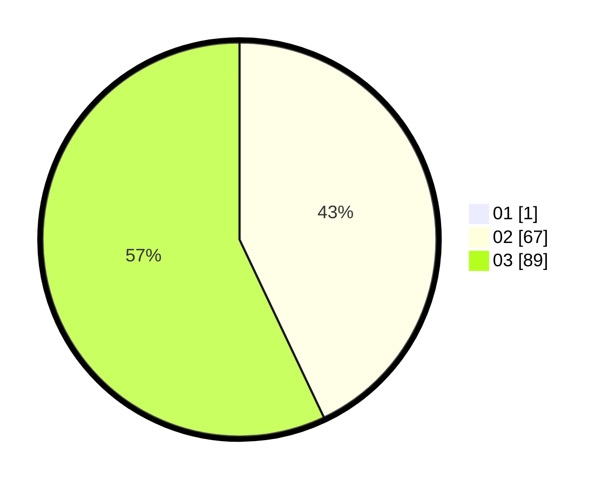

# Hasil

Hasil perolehan suara paslon dapat dilihat pada file paslon-01.txt, paslon-02.txt, dan paslon-03.txt.

Jika tidak ada, artinya data tersebut belum ada pada SIREKAP.

## Perolehan Suara

 * Paslon 01: **1**.
 * Paslon 02: **67**.
 * Paslon 03: **89**.

## Foto C Plano

https://sirekap-obj-formc.kpu.go.id/cad4/pemilu/ppwp/31/73/05/10/05/3173051005184-20240214-203123--71f296b9-00e4-476b-a113-025dc9981aea.jpg

https://sirekap-obj-formc.kpu.go.id/cad4/pemilu/ppwp/31/73/05/10/05/3173051005184-20240214-203133--386a3ce6-bf37-4bc8-a99b-c925ed7004bf.jpg

https://sirekap-obj-formc.kpu.go.id/cad4/pemilu/ppwp/31/73/05/10/05/3173051005184-20240214-203147--572bcb56-f607-475f-87e4-acb5864da0b6.jpg

## DATA PEMILIH TETAP

Jumlah pemilih dalam DPT: **272**.
 * L: **132**.
 * P: **140**.

## DATA PENGGUNA HAK PILIH

Jumlah pengguna hak pilih dalam DPT: **152**.
 * L: **75**.
 * P: **77**.

Jumlah pengguna hak pilih dalam DPTb: **0**.
 * L: **0**.
 * P: **0**.

Jumlah pengguna hak pilih dalam DPK: **6**.
 * L: **3**.
 * P: **3**.

Jumlah pengguna hak pilih: **158**.
 * L: **78**.
 * P: **80**.

## JUMLAH SUARA SAH DAN TIDAK SAH

JUMLAH SELURUH SUARA SAH: **157**.

JUMLAH SUARA TIDAK SAH: **1**.

JUMLAH SELURUH SUARA SAH DAN SUARA TIDAK SAH: **158**.
