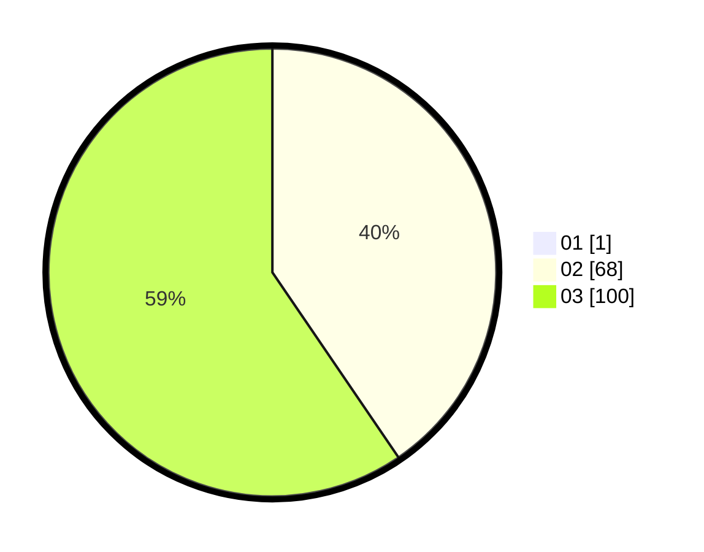

# Hasil

Hasil perolehan suara paslon dapat dilihat pada file paslon-01.txt, paslon-02.txt, dan paslon-03.txt.

Jika tidak ada, artinya data tersebut belum ada pada SIREKAP.

## Perolehan Suara

 * Paslon 01: **1**.
 * Paslon 02: **68**.
 * Paslon 03: **100**.

## Foto C Plano

https://sirekap-obj-formc.kpu.go.id/de26/pemilu/ppwp/31/73/05/10/05/3173051005189-20240214-155711--1a79e5b7-e493-4284-8f8a-ce61f7ab8708.jpg

https://sirekap-obj-formc.kpu.go.id/de26/pemilu/ppwp/31/73/05/10/05/3173051005189-20240214-160055--1d21369f-8098-457c-ad3a-39f901f49873.jpg

https://sirekap-obj-formc.kpu.go.id/de26/pemilu/ppwp/31/73/05/10/05/3173051005189-20240214-160105--bd46b0c4-e9e3-42a9-a354-ab840d03e96f.jpg

## DATA PEMILIH TETAP

Jumlah pemilih dalam DPT: **277**.
 * L: **131**.
 * P: **146**.

## DATA PENGGUNA HAK PILIH

Jumlah pengguna hak pilih dalam DPT: **166**.
 * L: **78**.
 * P: **88**.

Jumlah pengguna hak pilih dalam DPTb: **1**.
 * L: **1**.
 * P: **0**.

Jumlah pengguna hak pilih dalam DPK: **4**.
 * L: **2**.
 * P: **2**.

Jumlah pengguna hak pilih: **171**.
 * L: **81**.
 * P: **90**.

## JUMLAH SUARA SAH DAN TIDAK SAH

JUMLAH SELURUH SUARA SAH: **169**.

JUMLAH SUARA TIDAK SAH: **2**.

JUMLAH SELURUH SUARA SAH DAN SUARA TIDAK SAH: **171**.
