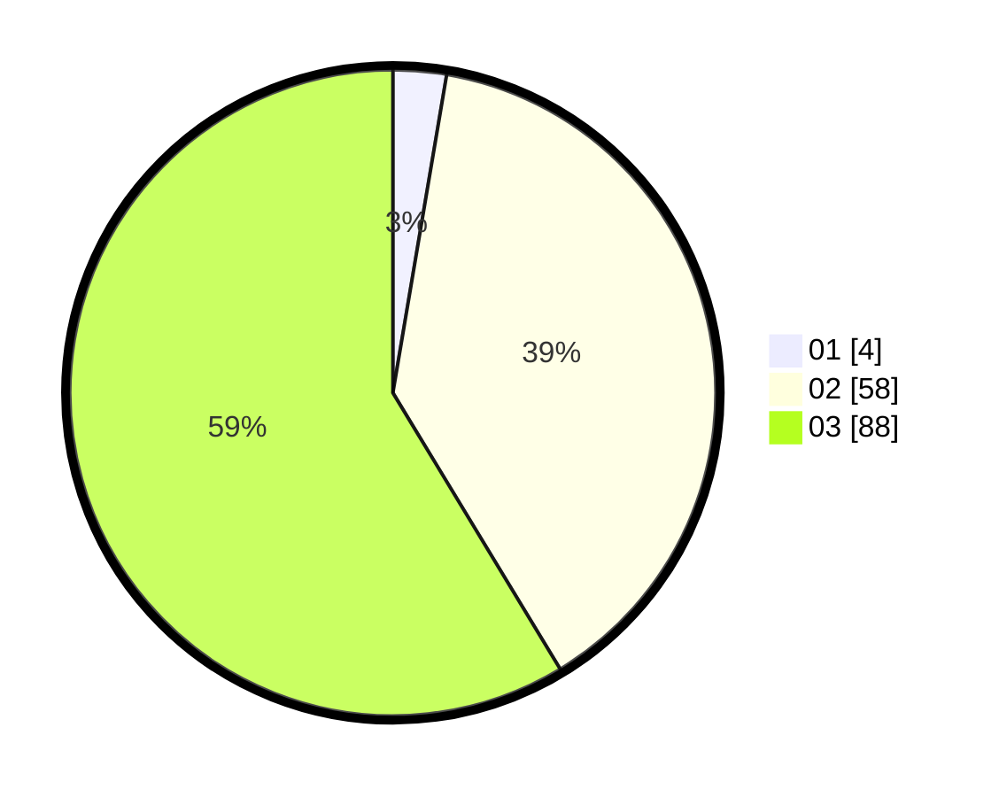

# Hasil

Hasil perolehan suara paslon dapat dilihat pada file paslon-01.txt, paslon-02.txt, dan paslon-03.txt.

Jika tidak ada, artinya data tersebut belum ada pada SIREKAP.

## Perolehan Suara

 * Paslon 01: **4**.
 * Paslon 02: **58**.
 * Paslon 03: **88**.

## Foto C Plano

https://sirekap-obj-formc.kpu.go.id/343a/pemilu/ppwp/31/73/05/10/05/3173051005191-20240217-160654--461add59-5d99-4dae-8362-66fe10adc160.jpg

https://sirekap-obj-formc.kpu.go.id/343a/pemilu/ppwp/31/73/05/10/05/3173051005191-20240217-115439--ce95f02a-fcc4-48f7-a913-784993793530.jpg
