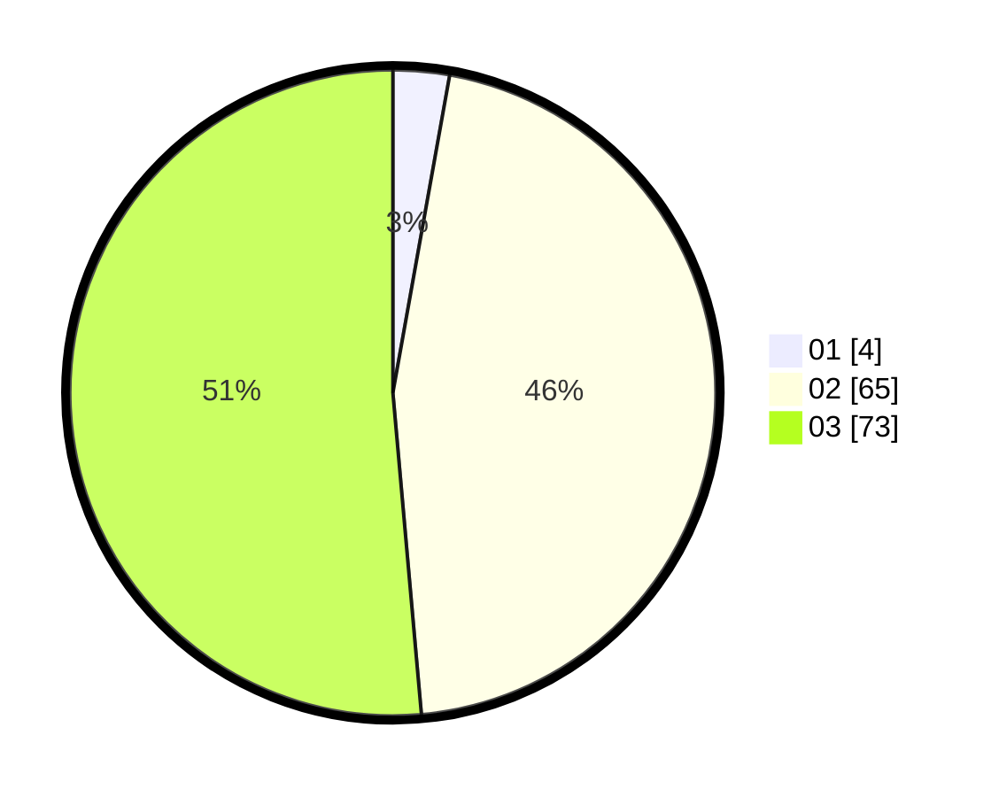

# Hasil

Hasil perolehan suara paslon dapat dilihat pada file paslon-01.txt, paslon-02.txt, dan paslon-03.txt.

Jika tidak ada, artinya data tersebut belum ada pada SIREKAP.

## Perolehan Suara

 * Paslon 01: **4**.
 * Paslon 02: **65**.
 * Paslon 03: **73**.

## Foto C Plano

https://sirekap-obj-formc.kpu.go.id/1b82/pemilu/ppwp/31/73/05/10/05/3173051005194-20240214-213607--888e11bd-2d0a-4b42-a345-f7a66dac6f25.jpg

https://sirekap-obj-formc.kpu.go.id/1b82/pemilu/ppwp/31/73/05/10/05/3173051005194-20240214-213659--7b769333-7858-446d-bb51-780f00ce066e.jpg
