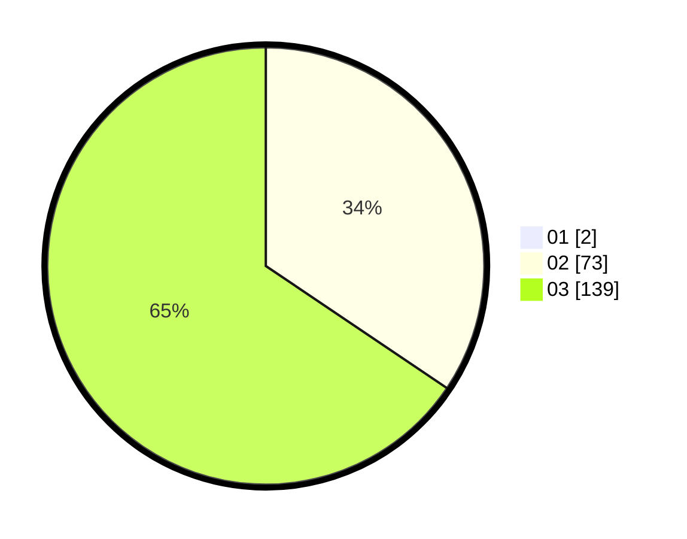

# Hasil

Hasil perolehan suara paslon dapat dilihat pada file paslon-01.txt, paslon-02.txt, dan paslon-03.txt.

Jika tidak ada, artinya data tersebut belum ada pada SIREKAP.

## Perolehan Suara

 * Paslon 01: **2**.
 * Paslon 02: **73**.
 * Paslon 03: **139**.

## Foto C Plano

https://sirekap-obj-formc.kpu.go.id/7ee2/pemilu/ppwp/31/73/05/10/05/3173051005198-20240214-230654--aeeeccd3-48db-45ef-9487-01867cbe371c.jpg

https://sirekap-obj-formc.kpu.go.id/7ee2/pemilu/ppwp/31/73/05/10/05/3173051005198-20240214-230724--e09821b1-5aab-4322-a41d-f980fe9b5acf.jpg

https://sirekap-obj-formc.kpu.go.id/7ee2/pemilu/ppwp/31/73/05/10/05/3173051005198-20240214-230745--63ce72a2-d7d6-4f80-8d2e-09e004cdb6ab.jpg
