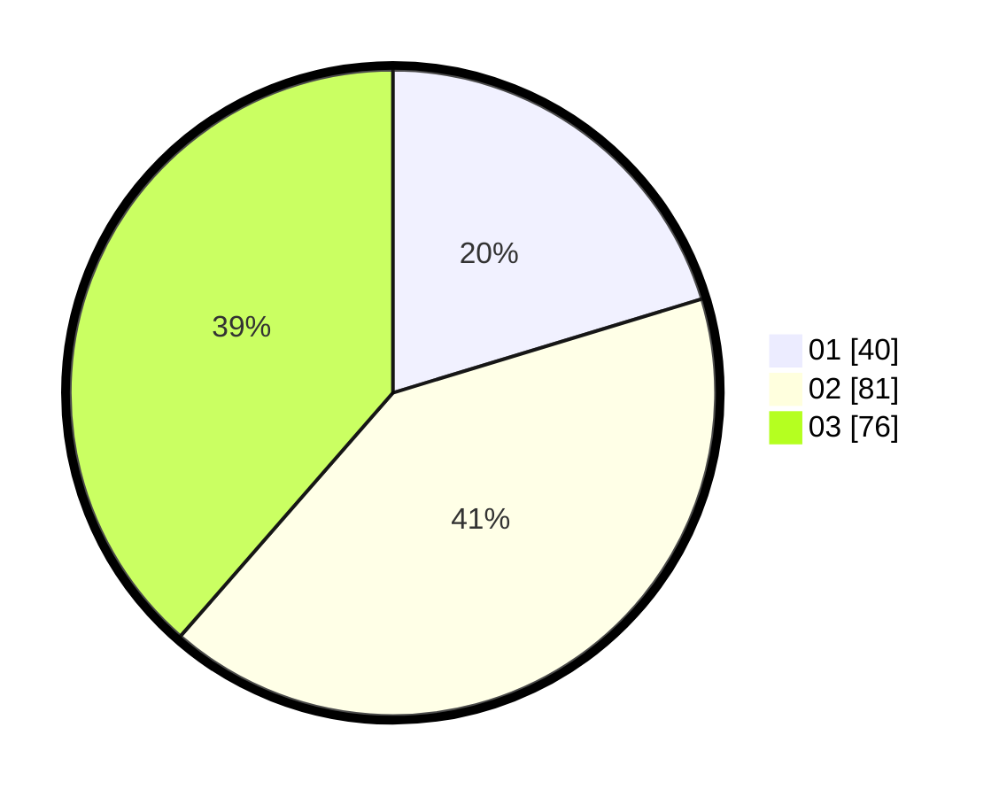

# Hasil

Hasil perolehan suara paslon dapat dilihat pada file paslon-01.txt, paslon-02.txt, dan paslon-03.txt.

Jika tidak ada, artinya data tersebut belum ada pada SIREKAP.

## Perolehan Suara

 * Paslon 01: **40**.
 * Paslon 02: **81**.
 * Paslon 03: **76**.

## Foto C Plano

https://sirekap-obj-formc.kpu.go.id/3b3c/pemilu/ppwp/31/73/05/10/06/3173051006004-20240214-214415--a051be59-fca9-471e-8709-f47fb5cc8992.jpg

https://sirekap-obj-formc.kpu.go.id/3b3c/pemilu/ppwp/31/73/05/10/06/3173051006004-20240214-214651--ad872be8-73ac-4eb4-b300-470d66962954.jpg

https://sirekap-obj-formc.kpu.go.id/3b3c/pemilu/ppwp/31/73/05/10/06/3173051006004-20240214-214755--7d9218af-380f-4dad-9df0-8fe8132a5761.jpg
