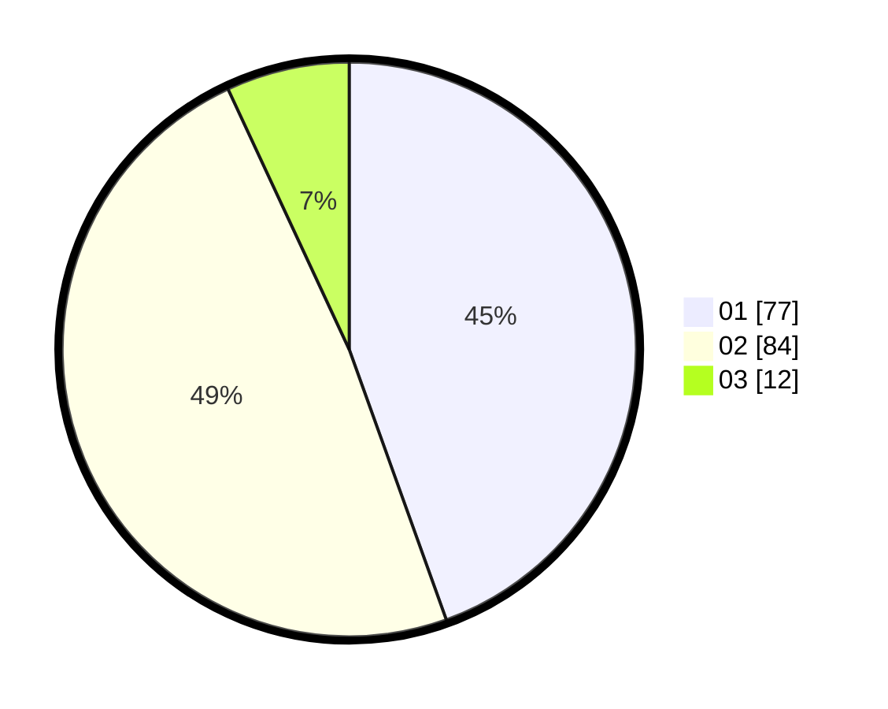

# Hasil

Hasil perolehan suara paslon dapat dilihat pada file paslon-01.txt, paslon-02.txt, dan paslon-03.txt.

Jika tidak ada, artinya data tersebut belum ada pada SIREKAP.

## Perolehan Suara

 * Paslon 01: **77**.
 * Paslon 02: **84**.
 * Paslon 03: **12**.

## Foto C Plano

https://sirekap-obj-formc.kpu.go.id/cae6/pemilu/ppwp/31/73/05/10/06/3173051006009-20240216-115600--04164100-c953-4924-bf4b-4f35f41577e0.jpg

https://sirekap-obj-formc.kpu.go.id/cae6/pemilu/ppwp/31/73/05/10/06/3173051006009-20240216-115607--e5ef02b6-689f-480e-8a3d-424c45072e07.jpg

https://sirekap-obj-formc.kpu.go.id/cae6/pemilu/ppwp/31/73/05/10/06/3173051006009-20240216-115604--4db1e493-af2b-4e31-b6d2-6840e5c199d1.jpg

## DATA PEMILIH TETAP

Jumlah pemilih dalam DPT: **234**.
 * L: **121**.
 * P: **113**.

## DATA PENGGUNA HAK PILIH

Jumlah pengguna hak pilih dalam DPT: **172**.
 * L: **86**.
 * P: **86**.

Jumlah pengguna hak pilih dalam DPTb: **2**.
 * L: **1**.
 * P: **1**.

Jumlah pengguna hak pilih dalam DPK: **0**.
 * L: **0**.
 * P: **0**.

Jumlah pengguna hak pilih: **174**.
 * L: **87**.
 * P: **87**.

## JUMLAH SUARA SAH DAN TIDAK SAH

JUMLAH SELURUH SUARA SAH: **173**.

JUMLAH SUARA TIDAK SAH: **1**.

JUMLAH SELURUH SUARA SAH DAN SUARA TIDAK SAH: **174**.
