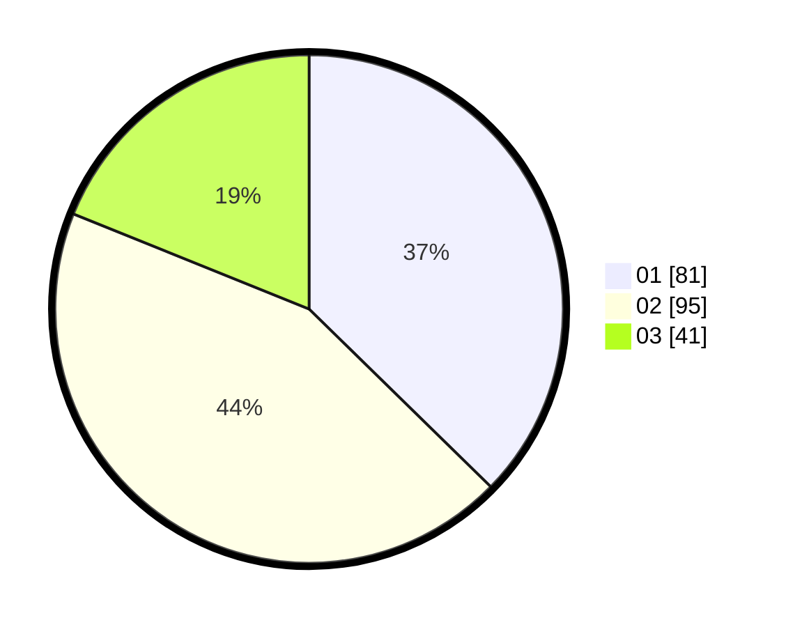

# Hasil

Hasil perolehan suara paslon dapat dilihat pada file paslon-01.txt, paslon-02.txt, dan paslon-03.txt.

Jika tidak ada, artinya data tersebut belum ada pada SIREKAP.

## Perolehan Suara

 * Paslon 01: **81**.
 * Paslon 02: **95**.
 * Paslon 03: **41**.

## Foto C Plano

https://sirekap-obj-formc.kpu.go.id/4ee3/pemilu/ppwp/31/73/05/10/06/3173051006010-20240214-224054--794b8d95-af1a-47d8-bb23-764cc6908fda.jpg

https://sirekap-obj-formc.kpu.go.id/4ee3/pemilu/ppwp/31/73/05/10/06/3173051006010-20240214-224245--cf66efcf-c520-423a-a8da-2f8dde07070b.jpg

https://sirekap-obj-formc.kpu.go.id/4ee3/pemilu/ppwp/31/73/05/10/06/3173051006010-20240214-224353--13a62176-c8b7-419a-a76f-a6ae6cd5a62e.jpg

## DATA PEMILIH TETAP

Jumlah pemilih dalam DPT: **282**.
 * L: **132**.
 * P: **150**.

## DATA PENGGUNA HAK PILIH

Jumlah pengguna hak pilih dalam DPT: **219**.
 * L: **106**.
 * P: **113**.

Jumlah pengguna hak pilih dalam DPTb: **1**.
 * L: **8**.
 * P: **1**.

Jumlah pengguna hak pilih dalam DPK: **0**.
 * L: **0**.
 * P: **0**.

Jumlah pengguna hak pilih: **220**.
 * L: **106**.
 * P: **114**.

## JUMLAH SUARA SAH DAN TIDAK SAH

JUMLAH SELURUH SUARA SAH: **217**.

JUMLAH SUARA TIDAK SAH: **3**.

JUMLAH SELURUH SUARA SAH DAN SUARA TIDAK SAH: **220**.
