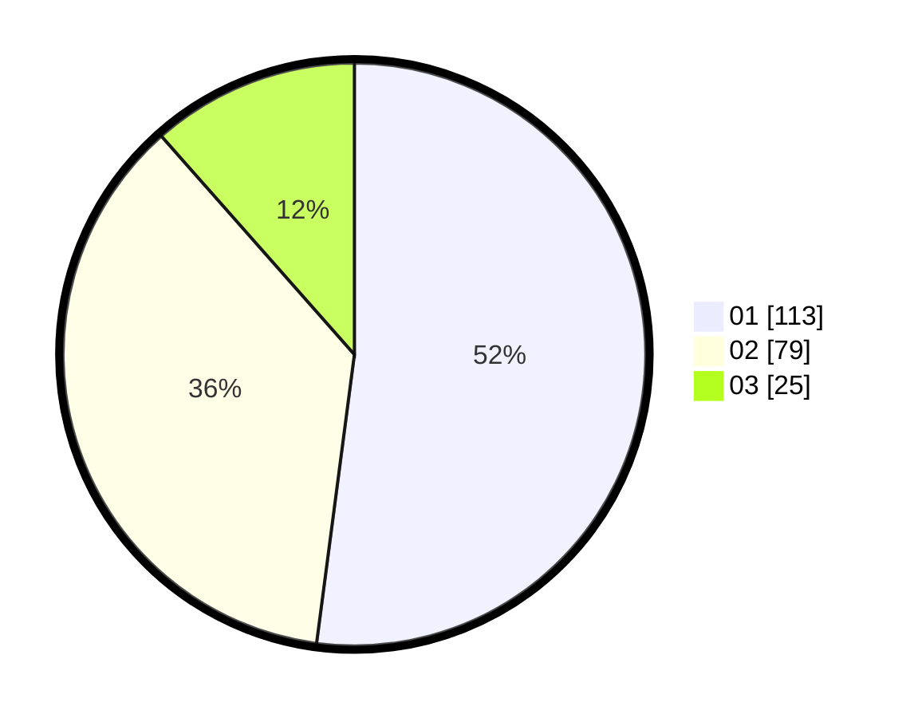

# Hasil

Hasil perolehan suara paslon dapat dilihat pada file paslon-01.txt, paslon-02.txt, dan paslon-03.txt.

Jika tidak ada, artinya data tersebut belum ada pada SIREKAP.

## Perolehan Suara

 * Paslon 01: **113**.
 * Paslon 02: **79**.
 * Paslon 03: **25**.

## Foto C Plano

https://sirekap-obj-formc.kpu.go.id/e1b0/pemilu/ppwp/31/73/05/10/06/3173051006013-20240214-194746--50497b72-53ee-4ed4-9fa3-15f2b1597d74.jpg

https://sirekap-obj-formc.kpu.go.id/e1b0/pemilu/ppwp/31/73/05/10/06/3173051006013-20240215-020144--9da07935-1a81-4e1b-849d-ab74de0bdaae.jpg

https://sirekap-obj-formc.kpu.go.id/e1b0/pemilu/ppwp/31/73/05/10/06/3173051006013-20240214-194812--5156b6dc-ba9e-4e3b-8f9d-ea715c03de17.jpg

## DATA PEMILIH TETAP

Jumlah pemilih dalam DPT: **274**.
 * L: **149**.
 * P: **125**.

## DATA PENGGUNA HAK PILIH

Jumlah pengguna hak pilih dalam DPT: **217**.
 * L: **116**.
 * P: **101**.

Jumlah pengguna hak pilih dalam DPTb: **1**.
 * L: **1**.
 * P: **0**.

Jumlah pengguna hak pilih dalam DPK: **1**.
 * L: **0**.
 * P: **1**.

Jumlah pengguna hak pilih: **219**.
 * L: **117**.
 * P: **102**.

## JUMLAH SUARA SAH DAN TIDAK SAH

JUMLAH SELURUH SUARA SAH: **217**.

JUMLAH SUARA TIDAK SAH: **2**.

JUMLAH SELURUH SUARA SAH DAN SUARA TIDAK SAH: **219**.
