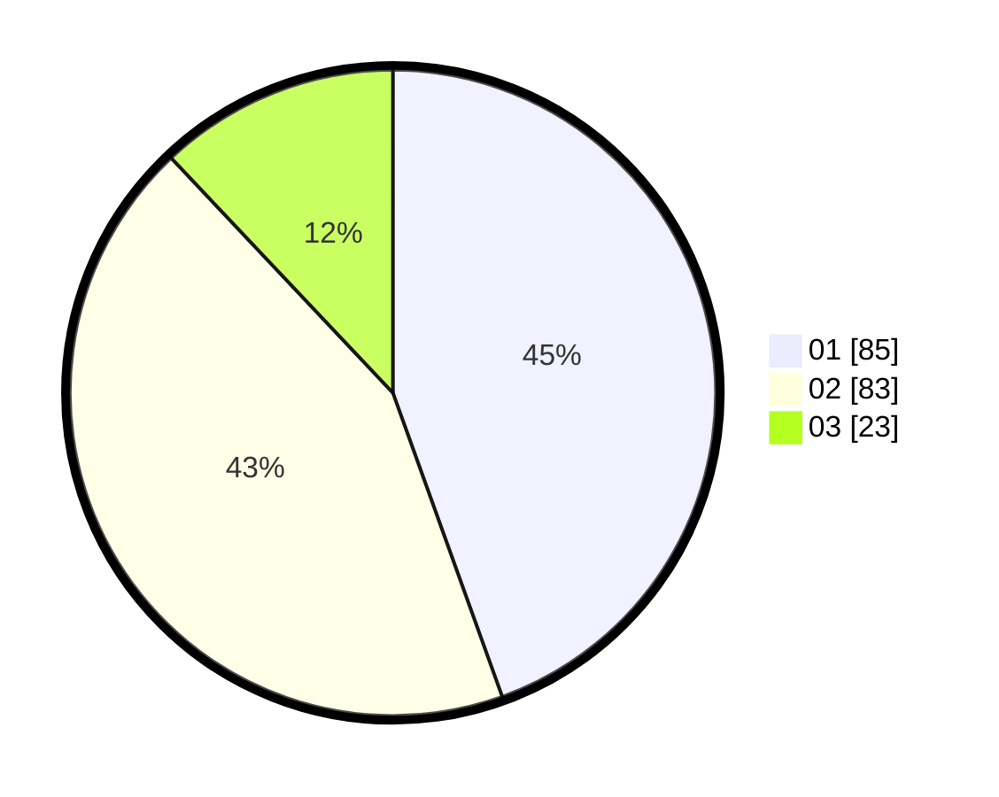

# Hasil

Hasil perolehan suara paslon dapat dilihat pada file paslon-01.txt, paslon-02.txt, dan paslon-03.txt.

Jika tidak ada, artinya data tersebut belum ada pada SIREKAP.

## Perolehan Suara

 * Paslon 01: **85**.
 * Paslon 02: **83**.
 * Paslon 03: **23**.

## Foto C Plano

https://sirekap-obj-formc.kpu.go.id/cc17/pemilu/ppwp/31/73/05/10/06/3173051006014-20240214-225305--09955bc4-04cd-4d6b-859a-820b5f688e30.jpg

https://sirekap-obj-formc.kpu.go.id/cc17/pemilu/ppwp/31/73/05/10/06/3173051006014-20240214-225527--9fe41309-bcba-47ee-9ca6-e3afd13bde36.jpg

https://sirekap-obj-formc.kpu.go.id/cc17/pemilu/ppwp/31/73/05/10/06/3173051006014-20240214-225713--e03c2fcf-c0fd-433b-ab6c-d465b39485d4.jpg
