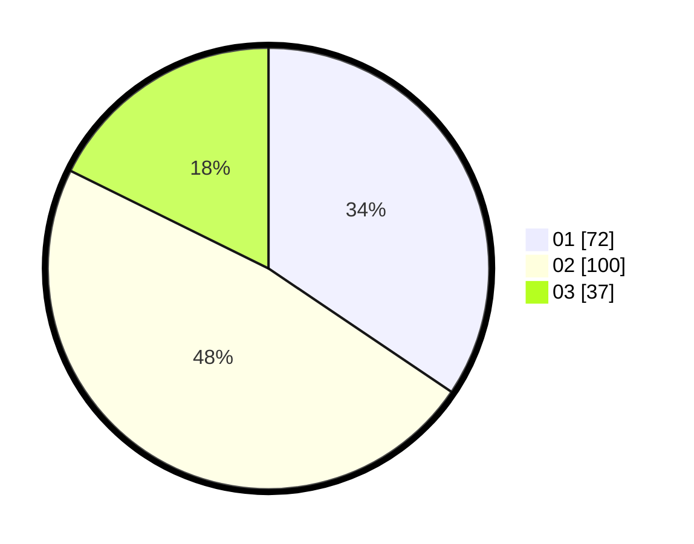

# Hasil

Hasil perolehan suara paslon dapat dilihat pada file paslon-01.txt, paslon-02.txt, dan paslon-03.txt.

Jika tidak ada, artinya data tersebut belum ada pada SIREKAP.

## Perolehan Suara

 * Paslon 01: **72**.
 * Paslon 02: **100**.
 * Paslon 03: **37**.

## Foto C Plano

https://sirekap-obj-formc.kpu.go.id/1059/pemilu/ppwp/31/73/05/10/06/3173051006021-20240215-052026--ff88a5a5-706f-4a9a-8dbb-2f3b9d448f7f.jpg

https://sirekap-obj-formc.kpu.go.id/1059/pemilu/ppwp/31/73/05/10/06/3173051006021-20240216-135121--2730c582-ff15-421d-bf4f-59c43752b26e.jpg

https://sirekap-obj-formc.kpu.go.id/1059/pemilu/ppwp/31/73/05/10/06/3173051006021-20240216-135321--5fadeeef-c404-44f8-aa70-fb55b13ed282.jpg

## DATA PEMILIH TETAP

Jumlah pemilih dalam DPT: **212**.
 * L: **98**.
 * P: **114**.

## DATA PENGGUNA HAK PILIH

Jumlah pengguna hak pilih dalam DPT: **212**.
 * L: **98**.
 * P: **114**.

Jumlah pengguna hak pilih dalam DPTb: **0**.
 * L: **0**.
 * P: **0**.

Jumlah pengguna hak pilih dalam DPK: **0**.
 * L: **0**.
 * P: **0**.

Jumlah pengguna hak pilih: **212**.
 * L: **98**.
 * P: **114**.

## JUMLAH SUARA SAH DAN TIDAK SAH

JUMLAH SELURUH SUARA SAH: **209**.

JUMLAH SUARA TIDAK SAH: **3**.

JUMLAH SELURUH SUARA SAH DAN SUARA TIDAK SAH: **212**.
