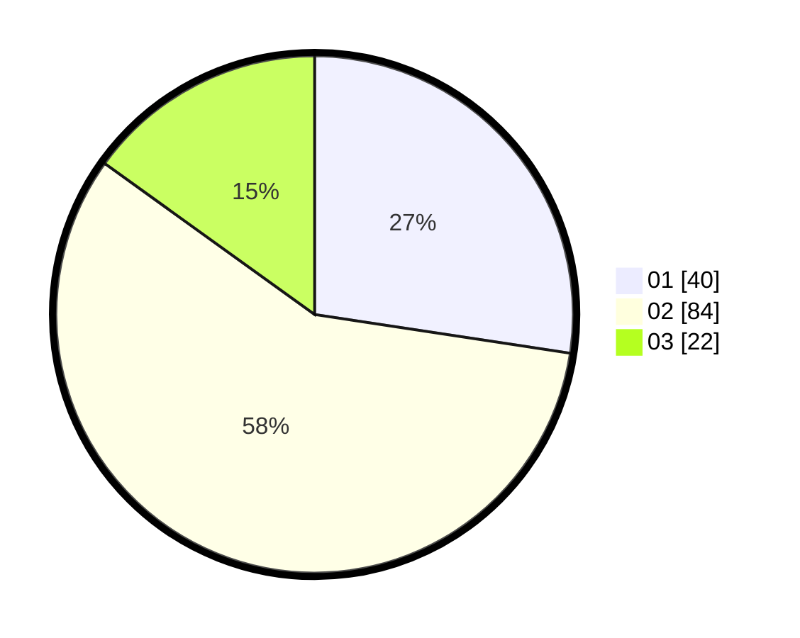

# Hasil

Hasil perolehan suara paslon dapat dilihat pada file paslon-01.txt, paslon-02.txt, dan paslon-03.txt.

Jika tidak ada, artinya data tersebut belum ada pada SIREKAP.

## Perolehan Suara

 * Paslon 01: **40**.
 * Paslon 02: **84**.
 * Paslon 03: **22**.

## Foto C Plano

https://sirekap-obj-formc.kpu.go.id/48ce/pemilu/ppwp/31/73/05/10/06/3173051006023-20240214-190802--61d421b5-9cda-4d02-bb70-ca334e72ad67.jpg

https://sirekap-obj-formc.kpu.go.id/48ce/pemilu/ppwp/31/73/05/10/06/3173051006023-20240214-190958--90a14a9c-6e1e-4dc6-977e-4be2a2155a42.jpg

https://sirekap-obj-formc.kpu.go.id/48ce/pemilu/ppwp/31/73/05/10/06/3173051006023-20240214-191106--3bcf84d1-638d-4b81-9e96-b7ccd3e58f95.jpg

## DATA PEMILIH TETAP

Jumlah pemilih dalam DPT: **206**.
 * L: **90**.
 * P: **116**.

## DATA PENGGUNA HAK PILIH

Jumlah pengguna hak pilih dalam DPT: **135**.
 * L: **55**.
 * P: **80**.

Jumlah pengguna hak pilih dalam DPTb: **9**.
 * L: **7**.
 * P: **2**.

Jumlah pengguna hak pilih dalam DPK: **3**.
 * L: **0**.
 * P: **3**.

Jumlah pengguna hak pilih: **147**.
 * L: **62**.
 * P: **85**.

## JUMLAH SUARA SAH DAN TIDAK SAH

JUMLAH SELURUH SUARA SAH: **146**.

JUMLAH SUARA TIDAK SAH: **1**.

JUMLAH SELURUH SUARA SAH DAN SUARA TIDAK SAH: **147**.
