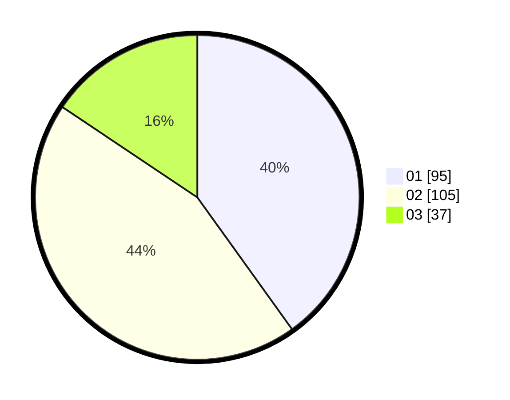

# Hasil

Hasil perolehan suara paslon dapat dilihat pada file paslon-01.txt, paslon-02.txt, dan paslon-03.txt.

Jika tidak ada, artinya data tersebut belum ada pada SIREKAP.

## Perolehan Suara

 * Paslon 01: **95**.
 * Paslon 02: **105**.
 * Paslon 03: **37**.

## Foto C Plano

https://sirekap-obj-formc.kpu.go.id/0795/pemilu/ppwp/31/73/05/10/06/3173051006025-20240216-062210--08d212e3-30e1-4011-84bc-2e814d9b4b81.jpg

https://sirekap-obj-formc.kpu.go.id/0795/pemilu/ppwp/31/73/05/10/06/3173051006025-20240216-062213--0bcc776e-192a-4ae5-a009-d9906be1cdcc.jpg

https://sirekap-obj-formc.kpu.go.id/0795/pemilu/ppwp/31/73/05/10/06/3173051006025-20240216-062211--b30559f0-3a96-4320-bf90-dca283d3f885.jpg

## DATA PEMILIH TETAP

Jumlah pemilih dalam DPT: **285**.
 * L: **149**.
 * P: **136**.

## DATA PENGGUNA HAK PILIH

Jumlah pengguna hak pilih dalam DPT: **222**.
 * L: **112**.
 * P: **110**.

Jumlah pengguna hak pilih dalam DPTb: **16**.
 * L: **12**.
 * P: **4**.

Jumlah pengguna hak pilih dalam DPK: **3**.
 * L: **1**.
 * P: **2**.

Jumlah pengguna hak pilih: **241**.
 * L: **125**.
 * P: **116**.

## JUMLAH SUARA SAH DAN TIDAK SAH

JUMLAH SELURUH SUARA SAH: **237**.

JUMLAH SUARA TIDAK SAH: **4**.

JUMLAH SELURUH SUARA SAH DAN SUARA TIDAK SAH: **241**.
