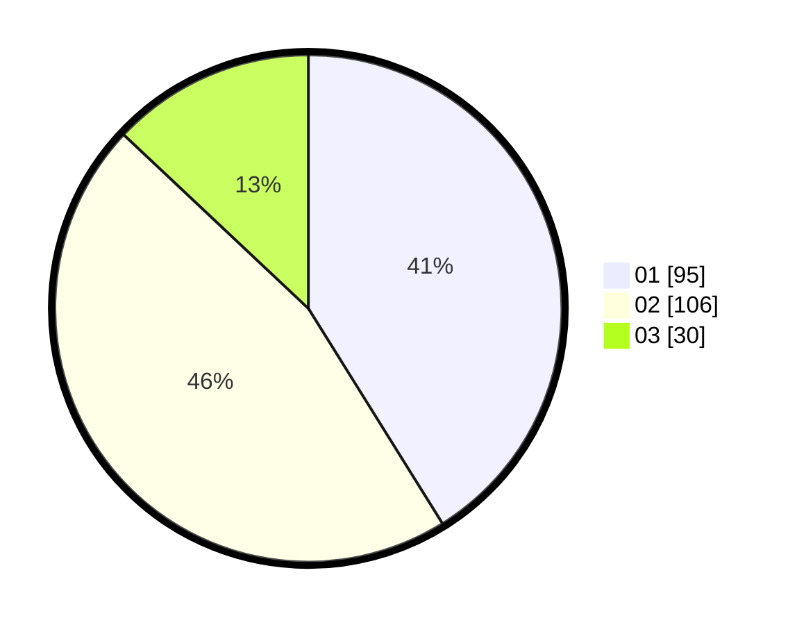

# Hasil

Hasil perolehan suara paslon dapat dilihat pada file paslon-01.txt, paslon-02.txt, dan paslon-03.txt.

Jika tidak ada, artinya data tersebut belum ada pada SIREKAP.

## Perolehan Suara

 * Paslon 01: **95**.
 * Paslon 02: **106**.
 * Paslon 03: **30**.

## Foto C Plano

https://sirekap-obj-formc.kpu.go.id/07f3/pemilu/ppwp/31/73/05/10/06/3173051006026-20240214-155120--128257a9-404e-413f-b9df-1f1e8cf25864.jpg

https://sirekap-obj-formc.kpu.go.id/07f3/pemilu/ppwp/31/73/05/10/06/3173051006026-20240216-061914--b78c6a73-97c2-4d17-8309-710e2b0cf01e.jpg

https://sirekap-obj-formc.kpu.go.id/07f3/pemilu/ppwp/31/73/05/10/06/3173051006026-20240216-061913--013c365a-c1a2-4ac2-a870-97b65c1fcb54.jpg

## DATA PEMILIH TETAP

Jumlah pemilih dalam DPT: **284**.
 * L: **137**.
 * P: **147**.

## DATA PENGGUNA HAK PILIH

Jumlah pengguna hak pilih dalam DPT: **233**.
 * L: **107**.
 * P: **126**.

Jumlah pengguna hak pilih dalam DPTb: **0**.
 * L: **0**.
 * P: **0**.

Jumlah pengguna hak pilih dalam DPK: **1**.
 * L: **0**.
 * P: **1**.

Jumlah pengguna hak pilih: **234**.
 * L: **107**.
 * P: **127**.

## JUMLAH SUARA SAH DAN TIDAK SAH

JUMLAH SELURUH SUARA SAH: **231**.

JUMLAH SUARA TIDAK SAH: **3**.

JUMLAH SELURUH SUARA SAH DAN SUARA TIDAK SAH: **234**.
