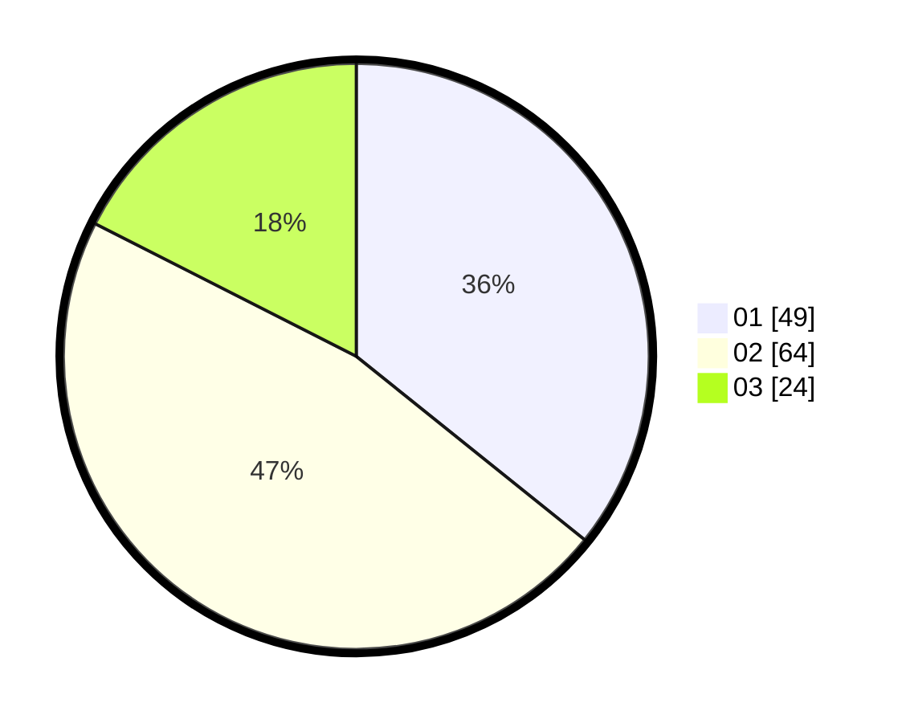

# Hasil

Hasil perolehan suara paslon dapat dilihat pada file paslon-01.txt, paslon-02.txt, dan paslon-03.txt.

Jika tidak ada, artinya data tersebut belum ada pada SIREKAP.

## Perolehan Suara

 * Paslon 01: **49**.
 * Paslon 02: **64**.
 * Paslon 03: **24**.

## Foto C Plano

https://sirekap-obj-formc.kpu.go.id/e8e5/pemilu/ppwp/31/73/05/10/06/3173051006027-20240215-235545--13600ce5-af21-45d4-9e84-c628974cc183.jpg

https://sirekap-obj-formc.kpu.go.id/e8e5/pemilu/ppwp/31/73/05/10/06/3173051006027-20240215-235548--14a74838-cf12-4d05-9b83-c0b0ca2365d7.jpg

https://sirekap-obj-formc.kpu.go.id/e8e5/pemilu/ppwp/31/73/05/10/06/3173051006027-20240215-235547--215c6441-32f7-48cf-8566-553029c46bb7.jpg

## DATA PEMILIH TETAP

Jumlah pemilih dalam DPT: **191**.
 * L: **103**.
 * P: **88**.

## DATA PENGGUNA HAK PILIH

Jumlah pengguna hak pilih dalam DPT: **138**.
 * L: **74**.
 * P: **64**.

Jumlah pengguna hak pilih dalam DPTb: **2**.
 * L: **1**.
 * P: **1**.

Jumlah pengguna hak pilih dalam DPK: **0**.
 * L: **0**.
 * P: **0**.

Jumlah pengguna hak pilih: **140**.
 * L: **75**.
 * P: **65**.

## JUMLAH SUARA SAH DAN TIDAK SAH

JUMLAH SELURUH SUARA SAH: **137**.

JUMLAH SUARA TIDAK SAH: **3**.

JUMLAH SELURUH SUARA SAH DAN SUARA TIDAK SAH: **140**.
