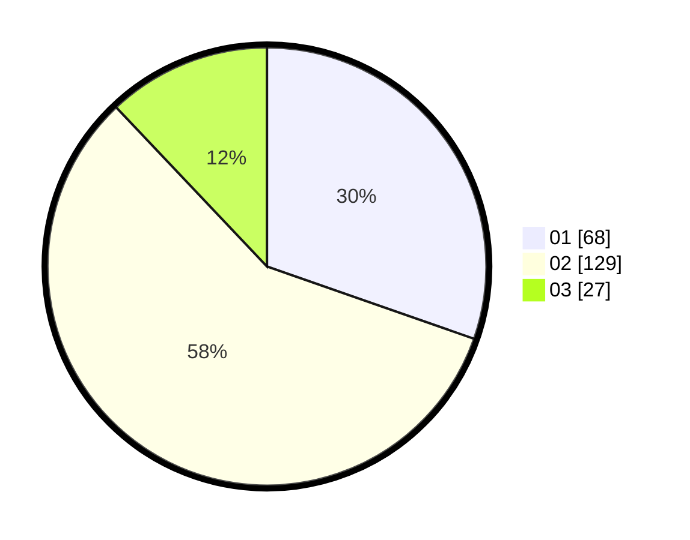

# Hasil

Hasil perolehan suara paslon dapat dilihat pada file paslon-01.txt, paslon-02.txt, dan paslon-03.txt.

Jika tidak ada, artinya data tersebut belum ada pada SIREKAP.

## Perolehan Suara

 * Paslon 01: **68**.
 * Paslon 02: **129**.
 * Paslon 03: **27**.

## Foto C Plano

https://sirekap-obj-formc.kpu.go.id/6ab6/pemilu/ppwp/31/73/05/10/06/3173051006029-20240214-204110--fd4ae391-53e4-4903-9a3b-9eb44020a66a.jpg

https://sirekap-obj-formc.kpu.go.id/6ab6/pemilu/ppwp/31/73/05/10/06/3173051006029-20240214-204357--42df5001-4a90-4ac1-8ce6-0afab3aed5a9.jpg

https://sirekap-obj-formc.kpu.go.id/6ab6/pemilu/ppwp/31/73/05/10/06/3173051006029-20240214-204608--b63ccaf1-1f6b-43c6-853e-7a86091ae7d3.jpg
