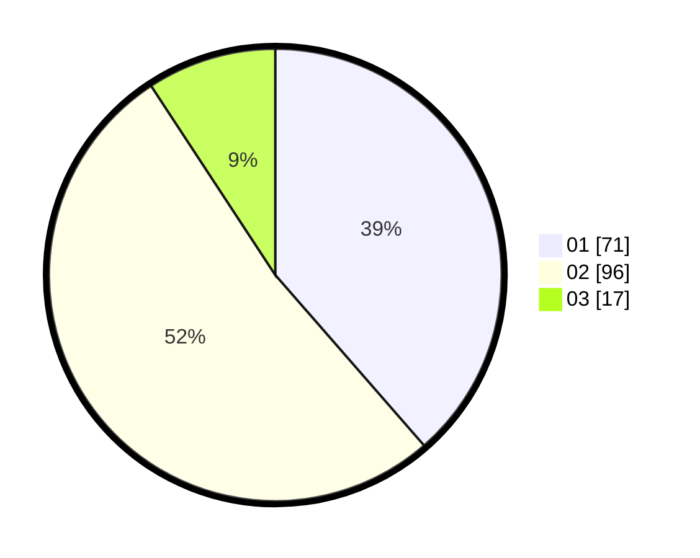

# Hasil

Hasil perolehan suara paslon dapat dilihat pada file paslon-01.txt, paslon-02.txt, dan paslon-03.txt.

Jika tidak ada, artinya data tersebut belum ada pada SIREKAP.

## Perolehan Suara

 * Paslon 01: **71**.
 * Paslon 02: **96**.
 * Paslon 03: **17**.

## Foto C Plano

https://sirekap-obj-formc.kpu.go.id/dde6/pemilu/ppwp/31/73/05/10/06/3173051006033-20240215-231654--4a67ed4f-952e-4ca1-baa2-801ace08edd5.jpg

https://sirekap-obj-formc.kpu.go.id/dde6/pemilu/ppwp/31/73/05/10/06/3173051006033-20240215-231657--1d059c67-6abb-4219-8869-a493bcd52413.jpg

https://sirekap-obj-formc.kpu.go.id/dde6/pemilu/ppwp/31/73/05/10/06/3173051006033-20240215-231655--bdbe408d-22f1-450f-8443-6999f0317011.jpg

## DATA PEMILIH TETAP

Jumlah pemilih dalam DPT: **270**.
 * L: **127**.
 * P: **143**.

## DATA PENGGUNA HAK PILIH

Jumlah pengguna hak pilih dalam DPT: **183**.
 * L: **90**.
 * P: **93**.

Jumlah pengguna hak pilih dalam DPTb: **2**.
 * L: **1**.
 * P: **1**.

Jumlah pengguna hak pilih dalam DPK: **0**.
 * L: **0**.
 * P: **0**.

Jumlah pengguna hak pilih: **185**.
 * L: **91**.
 * P: **94**.

## JUMLAH SUARA SAH DAN TIDAK SAH

JUMLAH SELURUH SUARA SAH: **184**.

JUMLAH SUARA TIDAK SAH: **1**.

JUMLAH SELURUH SUARA SAH DAN SUARA TIDAK SAH: **185**.
