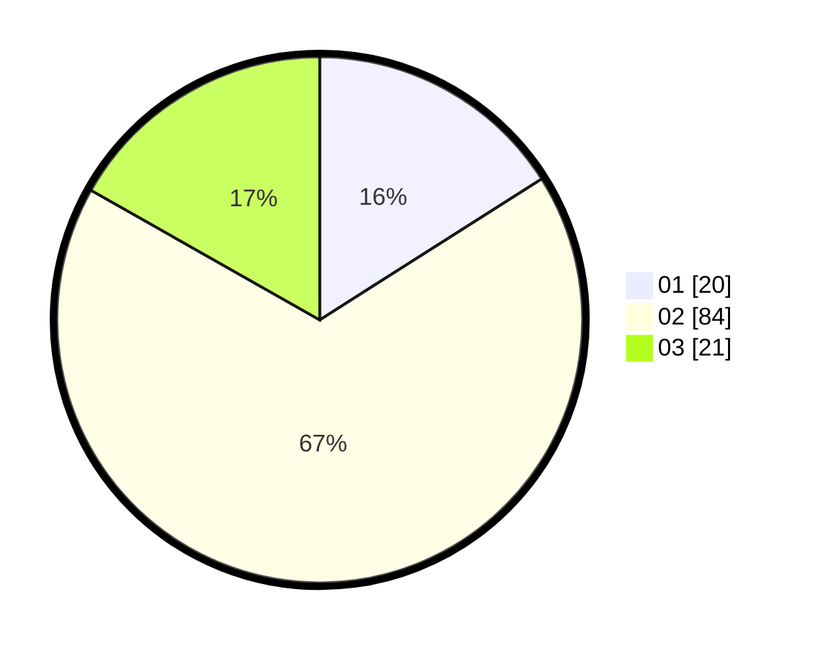

# Hasil

Hasil perolehan suara paslon dapat dilihat pada file paslon-01.txt, paslon-02.txt, dan paslon-03.txt.

Jika tidak ada, artinya data tersebut belum ada pada SIREKAP.

## Perolehan Suara

 * Paslon 01: **20**.
 * Paslon 02: **84**.
 * Paslon 03: **21**.

## Foto C Plano

https://sirekap-obj-formc.kpu.go.id/a8d5/pemilu/ppwp/31/73/05/10/06/3173051006038-20240214-195520--61096fb7-6dff-4a37-bf7a-e9a29cf6e4a3.jpg

https://sirekap-obj-formc.kpu.go.id/a8d5/pemilu/ppwp/31/73/05/10/06/3173051006038-20240214-195530--5558f0b6-8629-4d1d-a6bf-13f95c7bcc96.jpg

https://sirekap-obj-formc.kpu.go.id/a8d5/pemilu/ppwp/31/73/05/10/06/3173051006038-20240215-014435--50dc3eed-537c-43e4-94f4-2cfd690eb036.jpg
