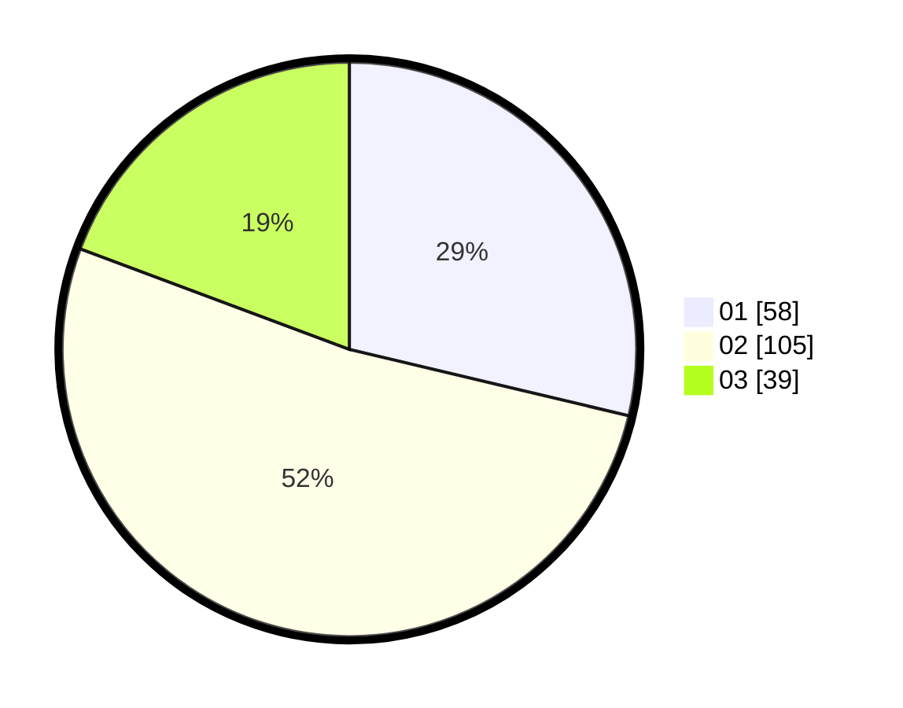

# Hasil

Hasil perolehan suara paslon dapat dilihat pada file paslon-01.txt, paslon-02.txt, dan paslon-03.txt.

Jika tidak ada, artinya data tersebut belum ada pada SIREKAP.

## Perolehan Suara

 * Paslon 01: **58**.
 * Paslon 02: **105**.
 * Paslon 03: **39**.

## Foto C Plano

https://sirekap-obj-formc.kpu.go.id/837f/pemilu/ppwp/31/73/05/10/06/3173051006039-20240216-063852--73166fd0-68a1-47ed-b76d-242c71ee97b6.jpg

https://sirekap-obj-formc.kpu.go.id/837f/pemilu/ppwp/31/73/05/10/06/3173051006039-20240216-063902--ee739906-10ff-4e72-bf12-4614eddd12f8.jpg

https://sirekap-obj-formc.kpu.go.id/837f/pemilu/ppwp/31/73/05/10/06/3173051006039-20240216-063900--84a03be3-9701-482d-83f4-ef140c8779dd.jpg

## DATA PEMILIH TETAP

Jumlah pemilih dalam DPT: **281**.
 * L: **140**.
 * P: **141**.

## DATA PENGGUNA HAK PILIH

Jumlah pengguna hak pilih dalam DPT: **197**.
 * L: **93**.
 * P: **104**.

Jumlah pengguna hak pilih dalam DPTb: **1**.
 * L: **0**.
 * P: **1**.

Jumlah pengguna hak pilih dalam DPK: **5**.
 * L: **1**.
 * P: **4**.

Jumlah pengguna hak pilih: **203**.
 * L: **94**.
 * P: **109**.

## JUMLAH SUARA SAH DAN TIDAK SAH

JUMLAH SELURUH SUARA SAH: **202**.

JUMLAH SUARA TIDAK SAH: **1**.

JUMLAH SELURUH SUARA SAH DAN SUARA TIDAK SAH: **203**.
