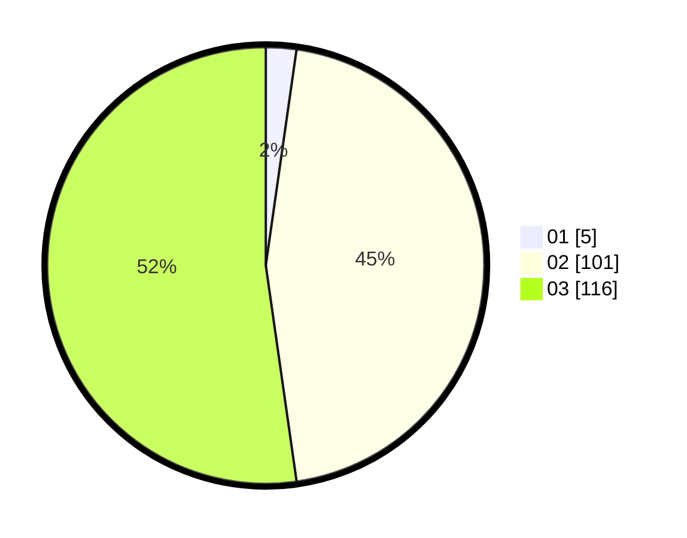

# Hasil

Hasil perolehan suara paslon dapat dilihat pada file paslon-01.txt, paslon-02.txt, dan paslon-03.txt.

Jika tidak ada, artinya data tersebut belum ada pada SIREKAP.

## Perolehan Suara

 * Paslon 01: **5**.
 * Paslon 02: **101**.
 * Paslon 03: **116**.

## Foto C Plano

https://sirekap-obj-formc.kpu.go.id/6f82/pemilu/ppwp/31/73/05/10/06/3173051006047-20240214-214244--671edf1e-642e-4b7f-9d2f-10b2012a5db4.jpg

https://sirekap-obj-formc.kpu.go.id/6f82/pemilu/ppwp/31/73/05/10/06/3173051006047-20240214-214332--5d000dfe-572d-41d5-8d2e-8b03be658554.jpg

https://sirekap-obj-formc.kpu.go.id/6f82/pemilu/ppwp/31/73/05/10/06/3173051006047-20240214-214417--338c0ce5-0ce7-4128-92bb-2100228029c3.jpg
