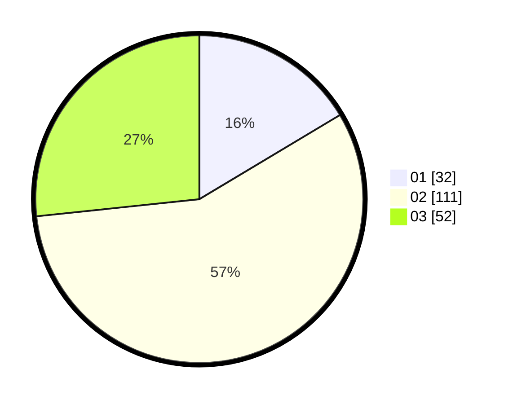

# Hasil

Hasil perolehan suara paslon dapat dilihat pada file paslon-01.txt, paslon-02.txt, dan paslon-03.txt.

Jika tidak ada, artinya data tersebut belum ada pada SIREKAP.

## Perolehan Suara

 * Paslon 01: **32**.
 * Paslon 02: **111**.
 * Paslon 03: **52**.

## Foto C Plano

https://sirekap-obj-formc.kpu.go.id/3129/pemilu/ppwp/31/73/05/10/06/3173051006050-20240214-234247--782060f9-3b9b-48cf-87f4-9dd69861bda2.jpg

https://sirekap-obj-formc.kpu.go.id/3129/pemilu/ppwp/31/73/05/10/06/3173051006050-20240214-234253--bbd83e4d-e22f-462b-ba36-f230e066795b.jpg

https://sirekap-obj-formc.kpu.go.id/3129/pemilu/ppwp/31/73/05/10/06/3173051006050-20240214-234258--1bdbde9e-268e-4131-a945-cbee6501266c.jpg

## DATA PEMILIH TETAP

Jumlah pemilih dalam DPT: **237**.
 * L: **112**.
 * P: **125**.

## DATA PENGGUNA HAK PILIH

Jumlah pengguna hak pilih dalam DPT: **191**.
 * L: **94**.
 * P: **97**.

Jumlah pengguna hak pilih dalam DPTb: **4**.
 * L: **4**.
 * P: **0**.

Jumlah pengguna hak pilih dalam DPK: **0**.
 * L: **0**.
 * P: **0**.

Jumlah pengguna hak pilih: **195**.
 * L: **98**.
 * P: **97**.

## JUMLAH SUARA SAH DAN TIDAK SAH

JUMLAH SELURUH SUARA SAH: **195**.

JUMLAH SUARA TIDAK SAH: **0**.

JUMLAH SELURUH SUARA SAH DAN SUARA TIDAK SAH: **195**.
