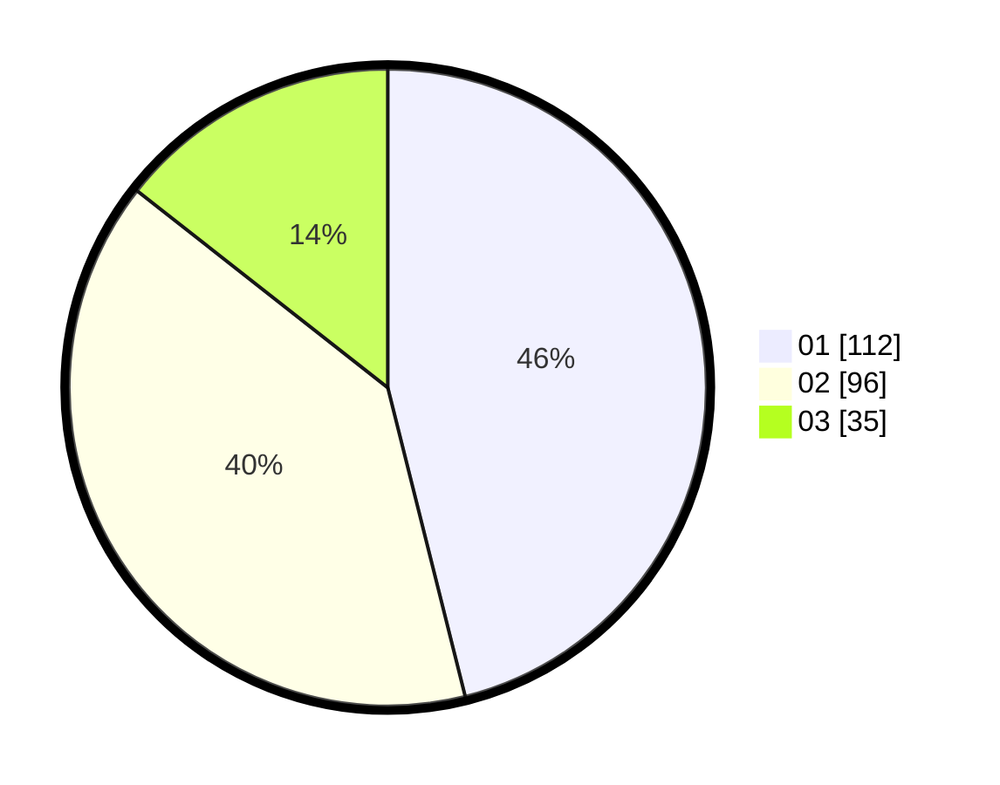

# Hasil

Hasil perolehan suara paslon dapat dilihat pada file paslon-01.txt, paslon-02.txt, dan paslon-03.txt.

Jika tidak ada, artinya data tersebut belum ada pada SIREKAP.

## Perolehan Suara

 * Paslon 01: **112**.
 * Paslon 02: **96**.
 * Paslon 03: **35**.

## Foto C Plano

https://sirekap-obj-formc.kpu.go.id/144c/pemilu/ppwp/31/73/05/10/06/3173051006055-20240215-021722--a2b35267-e160-4a0a-8783-54876ae8ed3d.jpg

https://sirekap-obj-formc.kpu.go.id/144c/pemilu/ppwp/31/73/05/10/06/3173051006055-20240214-175305--89d8a2d8-d660-463d-9ef3-4b51bdff7339.jpg

https://sirekap-obj-formc.kpu.go.id/144c/pemilu/ppwp/31/73/05/10/06/3173051006055-20240215-021804--d60f24cf-f726-4d22-aeff-037083511510.jpg

## DATA PEMILIH TETAP

Jumlah pemilih dalam DPT: **283**.
 * L: **143**.
 * P: **140**.

## DATA PENGGUNA HAK PILIH

Jumlah pengguna hak pilih dalam DPT: **239**.
 * L: **116**.
 * P: **123**.

Jumlah pengguna hak pilih dalam DPTb: **4**.
 * L: **2**.
 * P: **2**.

Jumlah pengguna hak pilih dalam DPK: **1**.
 * L: **1**.
 * P: **0**.

Jumlah pengguna hak pilih: **244**.
 * L: **119**.
 * P: **125**.

## JUMLAH SUARA SAH DAN TIDAK SAH

JUMLAH SELURUH SUARA SAH: **244**.

JUMLAH SUARA TIDAK SAH: **1**.

JUMLAH SELURUH SUARA SAH DAN SUARA TIDAK SAH: **245**.
