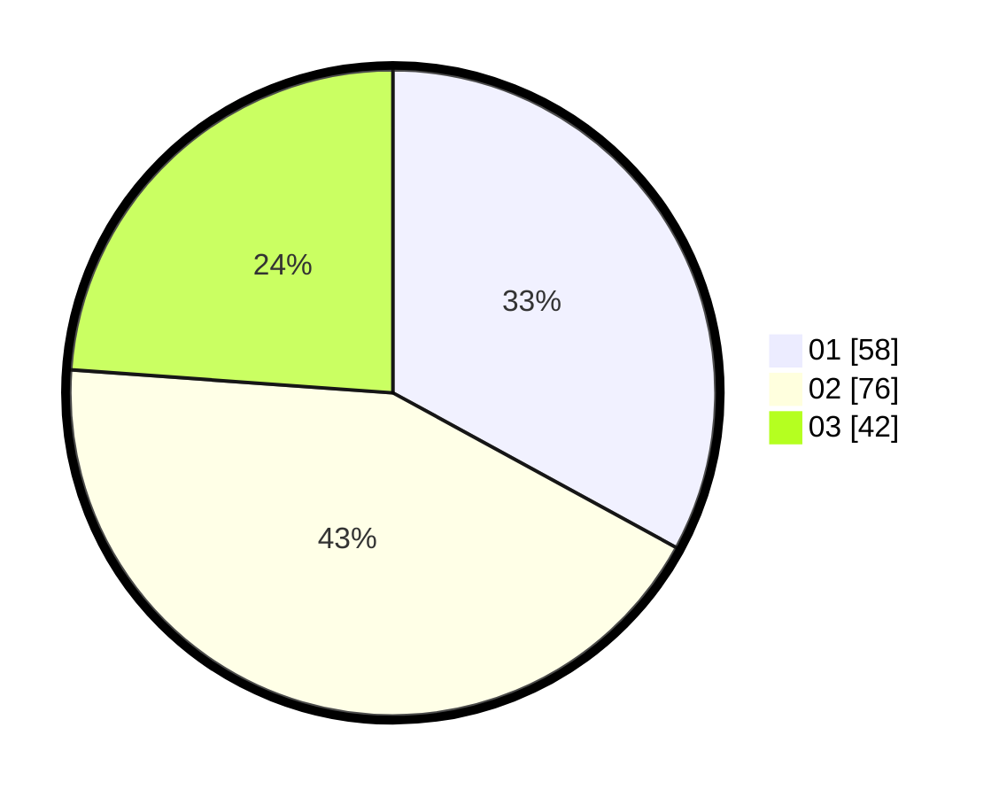

# Hasil

Hasil perolehan suara paslon dapat dilihat pada file paslon-01.txt, paslon-02.txt, dan paslon-03.txt.

Jika tidak ada, artinya data tersebut belum ada pada SIREKAP.

## Perolehan Suara

 * Paslon 01: **58**.
 * Paslon 02: **76**.
 * Paslon 03: **42**.

## Foto C Plano

https://sirekap-obj-formc.kpu.go.id/c00e/pemilu/ppwp/31/73/05/10/06/3173051006060-20240214-235941--505eac60-f28a-4696-988a-e4d4f8c59237.jpg

https://sirekap-obj-formc.kpu.go.id/c00e/pemilu/ppwp/31/73/05/10/06/3173051006060-20240214-205117--5b1070d4-0445-4324-a4d0-7b3af1f76eab.jpg

https://sirekap-obj-formc.kpu.go.id/c00e/pemilu/ppwp/31/73/05/10/06/3173051006060-20240214-205243--f5aa2690-a674-48ce-8271-632713c75d80.jpg
