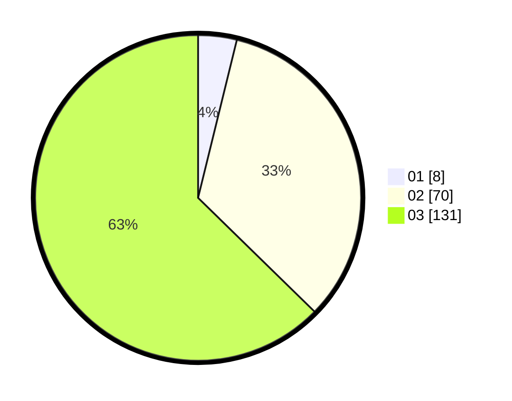

# Hasil

Hasil perolehan suara paslon dapat dilihat pada file paslon-01.txt, paslon-02.txt, dan paslon-03.txt.

Jika tidak ada, artinya data tersebut belum ada pada SIREKAP.

## Perolehan Suara

 * Paslon 01: **8**.
 * Paslon 02: **70**.
 * Paslon 03: **131**.

## Foto C Plano

https://sirekap-obj-formc.kpu.go.id/1d02/pemilu/ppwp/31/73/05/10/06/3173051006062-20240216-123954--0b831e88-1744-40b3-8907-2ccd510c5d19.jpg

https://sirekap-obj-formc.kpu.go.id/1d02/pemilu/ppwp/31/73/05/10/06/3173051006062-20240216-123957--04476b76-2221-43e7-935d-cc039e6f9e03.jpg

https://sirekap-obj-formc.kpu.go.id/1d02/pemilu/ppwp/31/73/05/10/06/3173051006062-20240216-123955--50d96e7a-4b1a-435f-a583-33b8c8da7c76.jpg

## DATA PEMILIH TETAP

Jumlah pemilih dalam DPT: **0**.
 * L: **0**.
 * P: **0**.

## DATA PENGGUNA HAK PILIH

Jumlah pengguna hak pilih dalam DPT: **0**.
 * L: **0**.
 * P: **0**.

Jumlah pengguna hak pilih dalam DPTb: **0**.
 * L: **0**.
 * P: **0**.

Jumlah pengguna hak pilih dalam DPK: **0**.
 * L: **0**.
 * P: **0**.

Jumlah pengguna hak pilih: **0**.
 * L: **0**.
 * P: **0**.

## JUMLAH SUARA SAH DAN TIDAK SAH

JUMLAH SELURUH SUARA SAH: **209**.

JUMLAH SUARA TIDAK SAH: **4**.

JUMLAH SELURUH SUARA SAH DAN SUARA TIDAK SAH: **213**.
