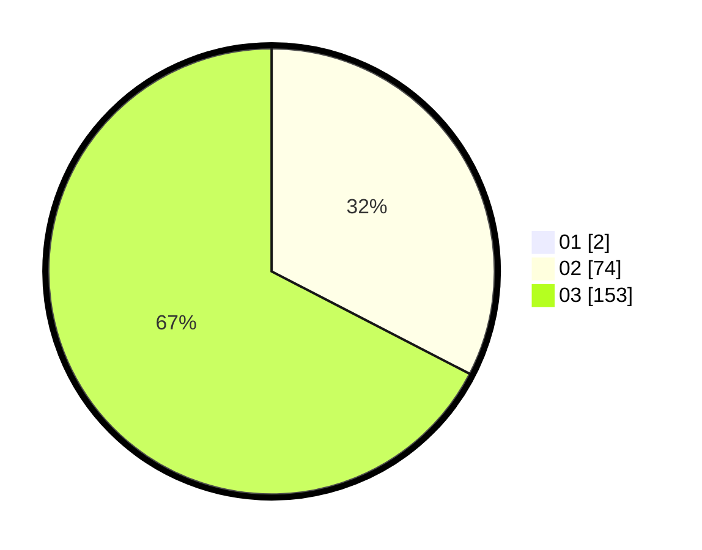

# Hasil

Hasil perolehan suara paslon dapat dilihat pada file paslon-01.txt, paslon-02.txt, dan paslon-03.txt.

Jika tidak ada, artinya data tersebut belum ada pada SIREKAP.

## Perolehan Suara

 * Paslon 01: **2**.
 * Paslon 02: **74**.
 * Paslon 03: **153**.

## Foto C Plano

https://sirekap-obj-formc.kpu.go.id/e80f/pemilu/ppwp/31/73/05/10/06/3173051006064-20240215-215216--9b44ef43-c740-4ea3-b42b-60a1d3828b90.jpg

https://sirekap-obj-formc.kpu.go.id/e80f/pemilu/ppwp/31/73/05/10/06/3173051006064-20240215-215218--951d76ee-a45f-4381-93d6-f3c88f728cbf.jpg

https://sirekap-obj-formc.kpu.go.id/e80f/pemilu/ppwp/31/73/05/10/06/3173051006064-20240215-215217--e2bb4fb4-09a5-4dac-b483-fb493e0dfb6a.jpg

## DATA PEMILIH TETAP

Jumlah pemilih dalam DPT: **293**.
 * L: **133**.
 * P: **160**.

## DATA PENGGUNA HAK PILIH

Jumlah pengguna hak pilih dalam DPT: **221**.
 * L: **103**.
 * P: **118**.

Jumlah pengguna hak pilih dalam DPTb: **10**.
 * L: **2**.
 * P: **8**.

Jumlah pengguna hak pilih dalam DPK: **1**.
 * L: **1**.
 * P: **0**.

Jumlah pengguna hak pilih: **232**.
 * L: **106**.
 * P: **126**.

## JUMLAH SUARA SAH DAN TIDAK SAH

JUMLAH SELURUH SUARA SAH: **229**.

JUMLAH SUARA TIDAK SAH: **3**.

JUMLAH SELURUH SUARA SAH DAN SUARA TIDAK SAH: **232**.
