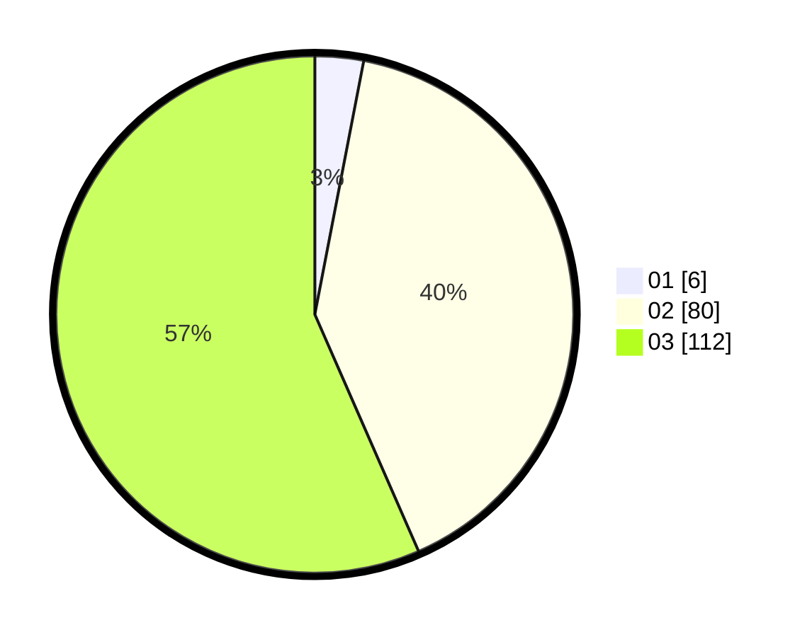

# Hasil

Hasil perolehan suara paslon dapat dilihat pada file paslon-01.txt, paslon-02.txt, dan paslon-03.txt.

Jika tidak ada, artinya data tersebut belum ada pada SIREKAP.

## Perolehan Suara

 * Paslon 01: **6**.
 * Paslon 02: **80**.
 * Paslon 03: **112**.

## Foto C Plano

https://sirekap-obj-formc.kpu.go.id/881e/pemilu/ppwp/31/73/05/10/06/3173051006065-20240216-140822--49869010-6e11-4f1c-a826-43934eaa79ca.jpg

https://sirekap-obj-formc.kpu.go.id/881e/pemilu/ppwp/31/73/05/10/06/3173051006065-20240216-140824--5c1dcbd6-0688-4d11-a958-97cf0286a5e8.jpg

https://sirekap-obj-formc.kpu.go.id/881e/pemilu/ppwp/31/73/05/10/06/3173051006065-20240216-140823--30b42f6b-4cf1-46d8-ac55-636ab6f1abd6.jpg

## DATA PEMILIH TETAP

Jumlah pemilih dalam DPT: **241**.
 * L: **112**.
 * P: **129**.

## DATA PENGGUNA HAK PILIH

Jumlah pengguna hak pilih dalam DPT: **186**.
 * L: **88**.
 * P: **98**.

Jumlah pengguna hak pilih dalam DPTb: **11**.
 * L: **3**.
 * P: **8**.

Jumlah pengguna hak pilih dalam DPK: **1**.
 * L: **1**.
 * P: **0**.

Jumlah pengguna hak pilih: **198**.
 * L: **92**.
 * P: **106**.

## JUMLAH SUARA SAH DAN TIDAK SAH

JUMLAH SELURUH SUARA SAH: **198**.

JUMLAH SUARA TIDAK SAH: **0**.

JUMLAH SELURUH SUARA SAH DAN SUARA TIDAK SAH: **198**.
