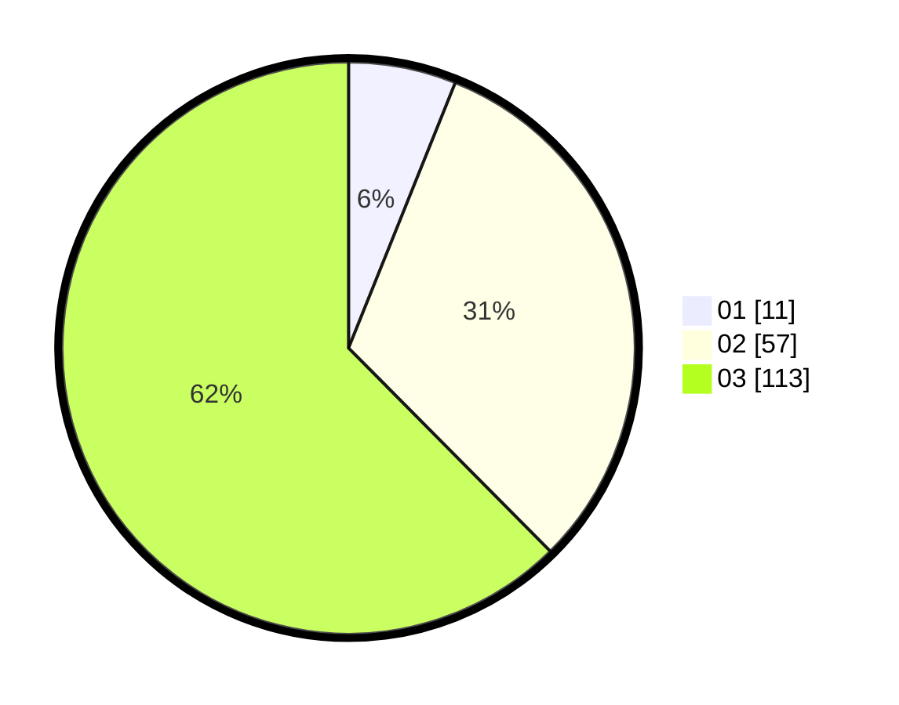

# Hasil

Hasil perolehan suara paslon dapat dilihat pada file paslon-01.txt, paslon-02.txt, dan paslon-03.txt.

Jika tidak ada, artinya data tersebut belum ada pada SIREKAP.

## Perolehan Suara

 * Paslon 01: **11**.
 * Paslon 02: **57**.
 * Paslon 03: **113**.

## Foto C Plano

https://sirekap-obj-formc.kpu.go.id/9362/pemilu/ppwp/31/73/05/10/06/3173051006066-20240216-150949--f01c175f-df09-40ab-9b35-2c14e436b8e6.jpg

https://sirekap-obj-formc.kpu.go.id/9362/pemilu/ppwp/31/73/05/10/06/3173051006066-20240216-150951--9551febe-2175-4891-a578-27f6a9eaeeec.jpg

https://sirekap-obj-formc.kpu.go.id/9362/pemilu/ppwp/31/73/05/10/06/3173051006066-20240216-150950--add7fa07-966c-4a2b-994d-48288df88ee3.jpg

## DATA PEMILIH TETAP

Jumlah pemilih dalam DPT: **225**.
 * L: **100**.
 * P: **125**.

## DATA PENGGUNA HAK PILIH

Jumlah pengguna hak pilih dalam DPT: **169**.
 * L: **83**.
 * P: **86**.

Jumlah pengguna hak pilih dalam DPTb: **10**.
 * L: **7**.
 * P: **3**.

Jumlah pengguna hak pilih dalam DPK: **2**.
 * L: **1**.
 * P: **1**.

Jumlah pengguna hak pilih: **181**.
 * L: **91**.
 * P: **90**.

## JUMLAH SUARA SAH DAN TIDAK SAH

JUMLAH SELURUH SUARA SAH: **181**.

JUMLAH SUARA TIDAK SAH: **1**.

JUMLAH SELURUH SUARA SAH DAN SUARA TIDAK SAH: **182**.
