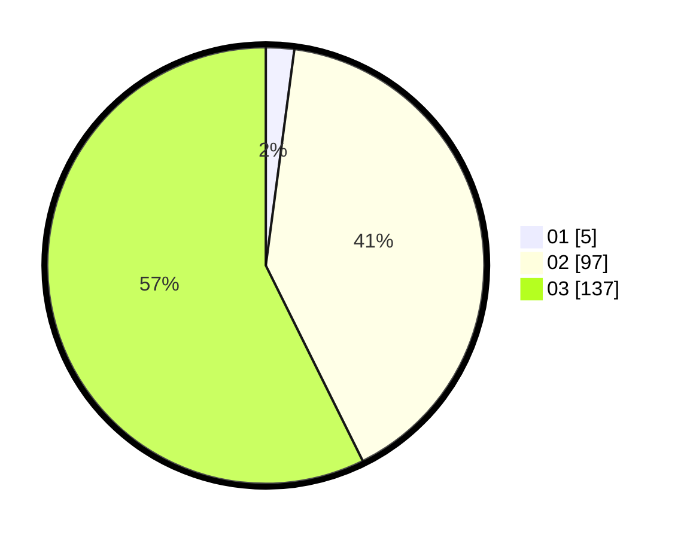

# Hasil

Hasil perolehan suara paslon dapat dilihat pada file paslon-01.txt, paslon-02.txt, dan paslon-03.txt.

Jika tidak ada, artinya data tersebut belum ada pada SIREKAP.

## Perolehan Suara

 * Paslon 01: **5**.
 * Paslon 02: **97**.
 * Paslon 03: **137**.

## Foto C Plano

https://sirekap-obj-formc.kpu.go.id/be40/pemilu/ppwp/31/73/05/10/06/3173051006067-20240216-140535--5484e762-bb25-4140-a5a6-1c1621723b13.jpg

https://sirekap-obj-formc.kpu.go.id/be40/pemilu/ppwp/31/73/05/10/06/3173051006067-20240216-140536--d8427d90-3d31-4347-adf9-8c1bd51c2d01.jpg

https://sirekap-obj-formc.kpu.go.id/be40/pemilu/ppwp/31/73/05/10/06/3173051006067-20240216-140535--9cc3c860-da96-4c57-a6d0-7fe9f2b0bcb9.jpg

## DATA PEMILIH TETAP

Jumlah pemilih dalam DPT: **298**.
 * L: **133**.
 * P: **165**.

## DATA PENGGUNA HAK PILIH

Jumlah pengguna hak pilih dalam DPT: **231**.
 * L: **102**.
 * P: **129**.

Jumlah pengguna hak pilih dalam DPTb: **10**.
 * L: **3**.
 * P: **7**.

Jumlah pengguna hak pilih dalam DPK: **0**.
 * L: **0**.
 * P: **0**.

Jumlah pengguna hak pilih: **241**.
 * L: **105**.
 * P: **136**.

## JUMLAH SUARA SAH DAN TIDAK SAH

JUMLAH SELURUH SUARA SAH: **239**.

JUMLAH SUARA TIDAK SAH: **2**.

JUMLAH SELURUH SUARA SAH DAN SUARA TIDAK SAH: **241**.
