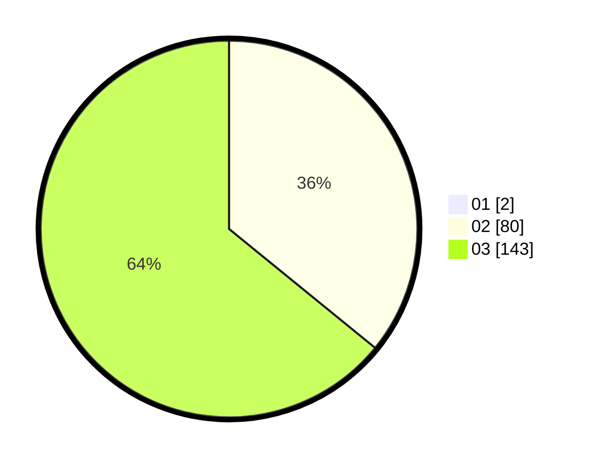

# Hasil

Hasil perolehan suara paslon dapat dilihat pada file paslon-01.txt, paslon-02.txt, dan paslon-03.txt.

Jika tidak ada, artinya data tersebut belum ada pada SIREKAP.

## Perolehan Suara

 * Paslon 01: **2**.
 * Paslon 02: **80**.
 * Paslon 03: **143**.

## Foto C Plano

https://sirekap-obj-formc.kpu.go.id/ecee/pemilu/ppwp/31/73/05/10/06/3173051006070-20240215-210312--0d1b84ce-045b-4549-9046-e79ace978b73.jpg

https://sirekap-obj-formc.kpu.go.id/ecee/pemilu/ppwp/31/73/05/10/06/3173051006070-20240215-210315--37215ba5-03f2-4e61-a843-3191dd4e0327.jpg

https://sirekap-obj-formc.kpu.go.id/ecee/pemilu/ppwp/31/73/05/10/06/3173051006070-20240215-210314--87c1131d-c9c9-4590-a4fe-9894128a90a9.jpg

## DATA PEMILIH TETAP

Jumlah pemilih dalam DPT: **289**.
 * L: **138**.
 * P: **151**.

## DATA PENGGUNA HAK PILIH

Jumlah pengguna hak pilih dalam DPT: **219**.
 * L: **103**.
 * P: **116**.

Jumlah pengguna hak pilih dalam DPTb: **7**.
 * L: **2**.
 * P: **5**.

Jumlah pengguna hak pilih dalam DPK: **3**.
 * L: **1**.
 * P: **2**.

Jumlah pengguna hak pilih: **229**.
 * L: **106**.
 * P: **123**.

## JUMLAH SUARA SAH DAN TIDAK SAH

JUMLAH SELURUH SUARA SAH: **225**.

JUMLAH SUARA TIDAK SAH: **4**.

JUMLAH SELURUH SUARA SAH DAN SUARA TIDAK SAH: **229**.
