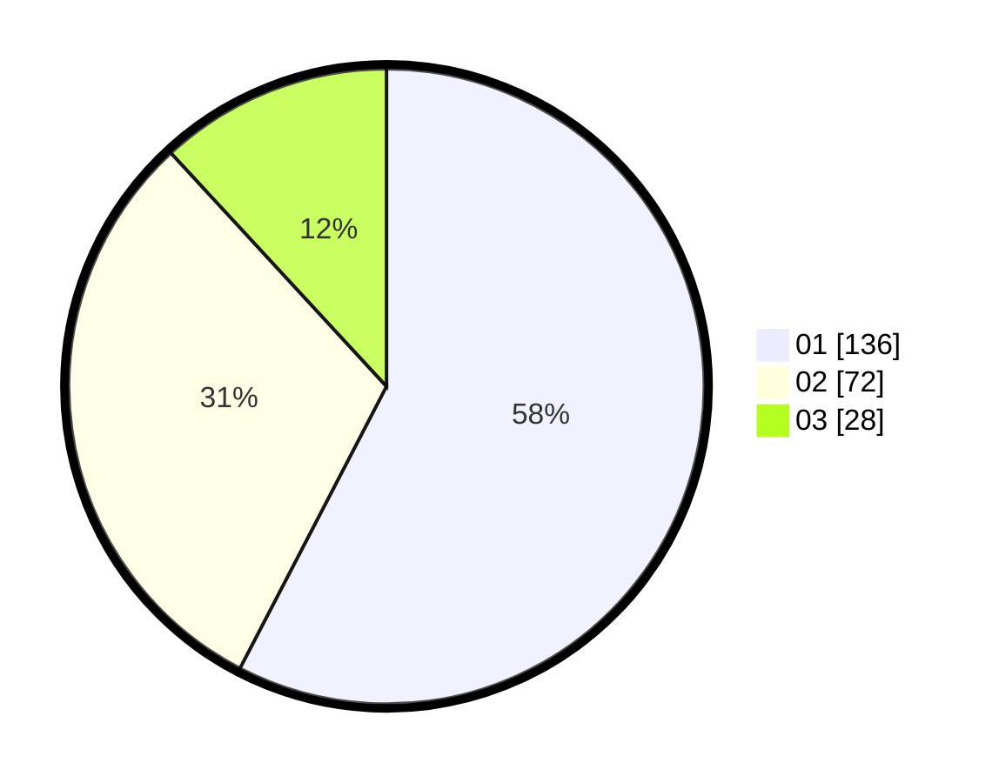

# Hasil

Hasil perolehan suara paslon dapat dilihat pada file paslon-01.txt, paslon-02.txt, dan paslon-03.txt.

Jika tidak ada, artinya data tersebut belum ada pada SIREKAP.

## Perolehan Suara

 * Paslon 01: **136**.
 * Paslon 02: **72**.
 * Paslon 03: **28**.

## Foto C Plano

https://sirekap-obj-formc.kpu.go.id/8753/pemilu/ppwp/31/73/05/10/06/3173051006071-20240215-231055--e6e7d86e-7072-4337-908b-1893e6b744b5.jpg

https://sirekap-obj-formc.kpu.go.id/8753/pemilu/ppwp/31/73/05/10/06/3173051006071-20240215-231058--d02d3ca1-b29c-4678-a92b-e0f6914a3a20.jpg

https://sirekap-obj-formc.kpu.go.id/8753/pemilu/ppwp/31/73/05/10/06/3173051006071-20240215-231056--9b05f309-f12d-4509-aa69-eb52e29a151c.jpg

## DATA PEMILIH TETAP

Jumlah pemilih dalam DPT: **0**.
 * L: **0**.
 * P: **0**.

## DATA PENGGUNA HAK PILIH

Jumlah pengguna hak pilih dalam DPT: **0**.
 * L: **0**.
 * P: **0**.

Jumlah pengguna hak pilih dalam DPTb: **0**.
 * L: **0**.
 * P: **0**.

Jumlah pengguna hak pilih dalam DPK: **0**.
 * L: **0**.
 * P: **0**.

Jumlah pengguna hak pilih: **0**.
 * L: **0**.
 * P: **0**.

## JUMLAH SUARA SAH DAN TIDAK SAH

JUMLAH SELURUH SUARA SAH: **236**.

JUMLAH SUARA TIDAK SAH: **2**.

JUMLAH SELURUH SUARA SAH DAN SUARA TIDAK SAH: **238**.
