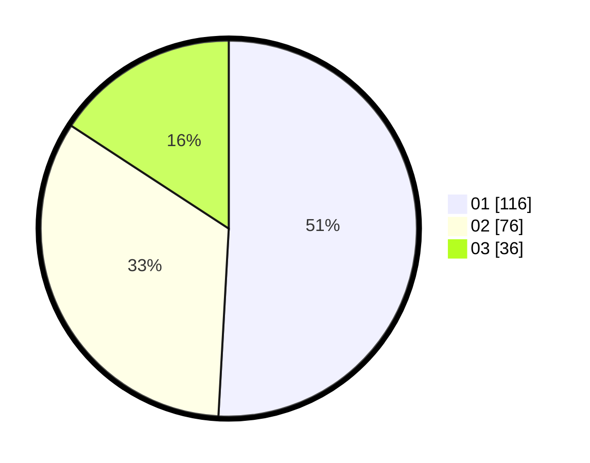

# Hasil

Hasil perolehan suara paslon dapat dilihat pada file paslon-01.txt, paslon-02.txt, dan paslon-03.txt.

Jika tidak ada, artinya data tersebut belum ada pada SIREKAP.

## Perolehan Suara

 * Paslon 01: **116**.
 * Paslon 02: **76**.
 * Paslon 03: **36**.

## Foto C Plano

https://sirekap-obj-formc.kpu.go.id/6551/pemilu/ppwp/31/73/05/10/06/3173051006075-20240215-212801--c84f8bd0-03a8-4b1c-a910-3393391b0639.jpg

https://sirekap-obj-formc.kpu.go.id/6551/pemilu/ppwp/31/73/05/10/06/3173051006075-20240215-212804--14824f35-77dc-49ba-bd76-adf645942185.jpg

https://sirekap-obj-formc.kpu.go.id/6551/pemilu/ppwp/31/73/05/10/06/3173051006075-20240215-212802--34549c3f-e463-4b82-a871-2450f1ea57e3.jpg

## DATA PEMILIH TETAP

Jumlah pemilih dalam DPT: **293**.
 * L: **141**.
 * P: **152**.

## DATA PENGGUNA HAK PILIH

Jumlah pengguna hak pilih dalam DPT: **232**.
 * L: **109**.
 * P: **123**.

Jumlah pengguna hak pilih dalam DPTb: **0**.
 * L: **0**.
 * P: **0**.

Jumlah pengguna hak pilih dalam DPK: **0**.
 * L: **0**.
 * P: **0**.

Jumlah pengguna hak pilih: **232**.
 * L: **109**.
 * P: **123**.

## JUMLAH SUARA SAH DAN TIDAK SAH

JUMLAH SELURUH SUARA SAH: **228**.

JUMLAH SUARA TIDAK SAH: **4**.

JUMLAH SELURUH SUARA SAH DAN SUARA TIDAK SAH: **232**.
