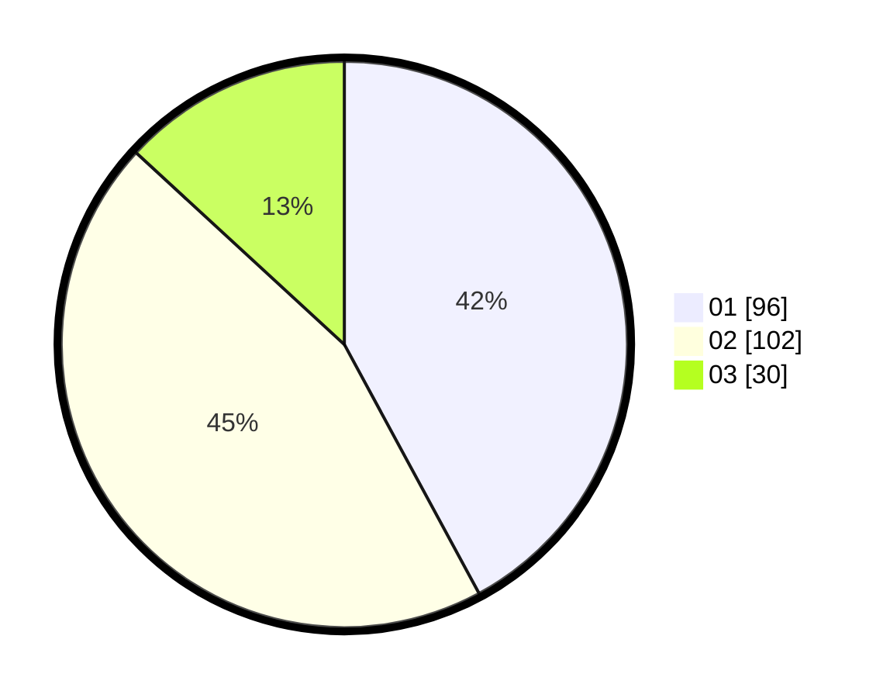

# Hasil

Hasil perolehan suara paslon dapat dilihat pada file paslon-01.txt, paslon-02.txt, dan paslon-03.txt.

Jika tidak ada, artinya data tersebut belum ada pada SIREKAP.

## Perolehan Suara

 * Paslon 01: **96**.
 * Paslon 02: **102**.
 * Paslon 03: **30**.

## Foto C Plano

https://sirekap-obj-formc.kpu.go.id/134c/pemilu/ppwp/31/73/05/10/06/3173051006082-20240214-232414--c50c35db-e397-4104-9f27-4c2164bc2af8.jpg

https://sirekap-obj-formc.kpu.go.id/134c/pemilu/ppwp/31/73/05/10/06/3173051006082-20240214-185305--9b4a1769-ad6e-4507-b590-d124ee6b672d.jpg

https://sirekap-obj-formc.kpu.go.id/134c/pemilu/ppwp/31/73/05/10/06/3173051006082-20240214-185308--ab04670a-864e-4b59-b9e8-e821b0984fb0.jpg
