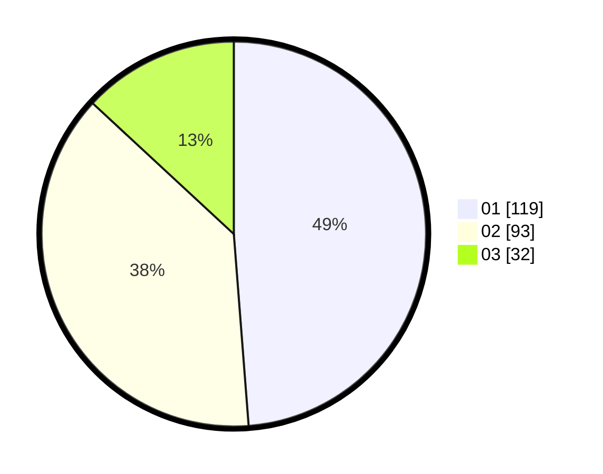

# Hasil

Hasil perolehan suara paslon dapat dilihat pada file paslon-01.txt, paslon-02.txt, dan paslon-03.txt.

Jika tidak ada, artinya data tersebut belum ada pada SIREKAP.

## Perolehan Suara

 * Paslon 01: **119**.
 * Paslon 02: **93**.
 * Paslon 03: **32**.

## Foto C Plano

https://sirekap-obj-formc.kpu.go.id/15d6/pemilu/ppwp/31/73/05/10/06/3173051006085-20240214-215305--ddb836b7-556d-468f-a9c1-c0505bff4305.jpg

https://sirekap-obj-formc.kpu.go.id/15d6/pemilu/ppwp/31/73/05/10/06/3173051006085-20240214-221942--538eb63b-bd9b-41be-b785-830aaec5d534.jpg

https://sirekap-obj-formc.kpu.go.id/15d6/pemilu/ppwp/31/73/05/10/06/3173051006085-20240214-222220--9b9458fb-f881-466a-97ac-e66c48b39295.jpg
