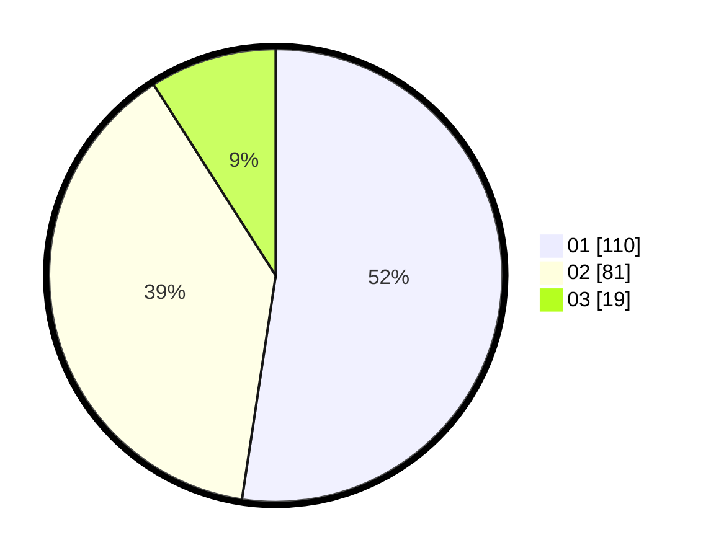

# Hasil

Hasil perolehan suara paslon dapat dilihat pada file paslon-01.txt, paslon-02.txt, dan paslon-03.txt.

Jika tidak ada, artinya data tersebut belum ada pada SIREKAP.

## Perolehan Suara

 * Paslon 01: **110**.
 * Paslon 02: **81**.
 * Paslon 03: **19**.

## Foto C Plano

https://sirekap-obj-formc.kpu.go.id/a182/pemilu/ppwp/31/73/05/10/06/3173051006089-20240214-230615--aea555d9-1462-4c04-9ab5-ae8912ae93dd.jpg

https://sirekap-obj-formc.kpu.go.id/a182/pemilu/ppwp/31/73/05/10/06/3173051006089-20240214-230736--8b29b04a-c6d1-42a1-adb7-d135433bc80d.jpg

https://sirekap-obj-formc.kpu.go.id/a182/pemilu/ppwp/31/73/05/10/06/3173051006089-20240214-230825--3f78d29b-6b65-45bb-b042-2a4f630546dc.jpg
