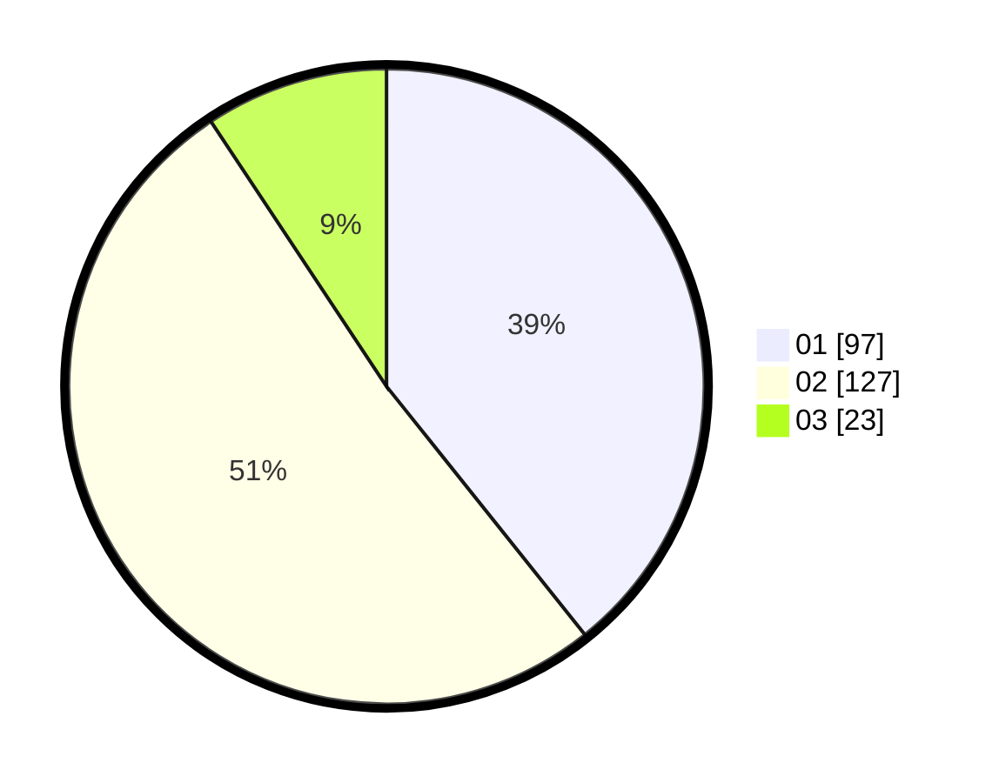

# Hasil

Hasil perolehan suara paslon dapat dilihat pada file paslon-01.txt, paslon-02.txt, dan paslon-03.txt.

Jika tidak ada, artinya data tersebut belum ada pada SIREKAP.

## Perolehan Suara

 * Paslon 01: **97**.
 * Paslon 02: **127**.
 * Paslon 03: **23**.

## Foto C Plano

https://sirekap-obj-formc.kpu.go.id/804e/pemilu/ppwp/31/73/05/10/06/3173051006092-20240215-051449--3d552284-59ea-4596-b2da-4bc4868ee8b8.jpg

https://sirekap-obj-formc.kpu.go.id/804e/pemilu/ppwp/31/73/05/10/06/3173051006092-20240214-230430--76ffb2a0-1036-4a30-a055-6f196ee715ea.jpg

https://sirekap-obj-formc.kpu.go.id/804e/pemilu/ppwp/31/73/05/10/06/3173051006092-20240214-230611--653689a7-c1a8-4ccc-a941-f9008ffa852c.jpg

## DATA PEMILIH TETAP

Jumlah pemilih dalam DPT: **294**.
 * L: **148**.
 * P: **146**.

## DATA PENGGUNA HAK PILIH

Jumlah pengguna hak pilih dalam DPT: **238**.
 * L: **122**.
 * P: **116**.

Jumlah pengguna hak pilih dalam DPTb: **9**.
 * L: **1**.
 * P: **8**.

Jumlah pengguna hak pilih dalam DPK: **0**.
 * L: **0**.
 * P: **0**.

Jumlah pengguna hak pilih: **247**.
 * L: **123**.
 * P: **124**.

## JUMLAH SUARA SAH DAN TIDAK SAH

JUMLAH SELURUH SUARA SAH: **247**.

JUMLAH SUARA TIDAK SAH: **0**.

JUMLAH SELURUH SUARA SAH DAN SUARA TIDAK SAH: **247**.
