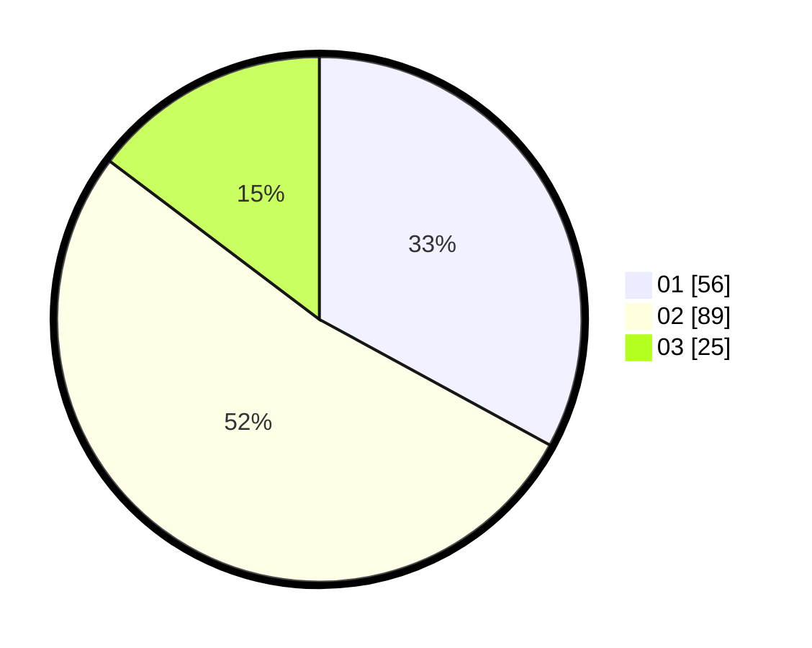

# Hasil

Hasil perolehan suara paslon dapat dilihat pada file paslon-01.txt, paslon-02.txt, dan paslon-03.txt.

Jika tidak ada, artinya data tersebut belum ada pada SIREKAP.

## Perolehan Suara

 * Paslon 01: **56**.
 * Paslon 02: **89**.
 * Paslon 03: **25**.

## Foto C Plano

https://sirekap-obj-formc.kpu.go.id/6b01/pemilu/ppwp/31/73/05/10/06/3173051006097-20240216-152340--ccc18d18-828c-46f0-ad5a-bd15ab7ef82b.jpg

https://sirekap-obj-formc.kpu.go.id/6b01/pemilu/ppwp/31/73/05/10/06/3173051006097-20240216-152342--e422ae28-bf9d-4eae-98a7-acd3d67bc96a.jpg

https://sirekap-obj-formc.kpu.go.id/6b01/pemilu/ppwp/31/73/05/10/06/3173051006097-20240216-152341--d9b66d7b-4d78-40db-881f-ea9f774dc914.jpg

## DATA PEMILIH TETAP

Jumlah pemilih dalam DPT: **224**.
 * L: **108**.
 * P: **116**.

## DATA PENGGUNA HAK PILIH

Jumlah pengguna hak pilih dalam DPT: **161**.
 * L: **84**.
 * P: **77**.

Jumlah pengguna hak pilih dalam DPTb: **3**.
 * L: **1**.
 * P: **2**.

Jumlah pengguna hak pilih dalam DPK: **10**.
 * L: **6**.
 * P: **4**.

Jumlah pengguna hak pilih: **174**.
 * L: **91**.
 * P: **83**.

## JUMLAH SUARA SAH DAN TIDAK SAH

JUMLAH SELURUH SUARA SAH: **170**.

JUMLAH SUARA TIDAK SAH: **4**.

JUMLAH SELURUH SUARA SAH DAN SUARA TIDAK SAH: **174**.
