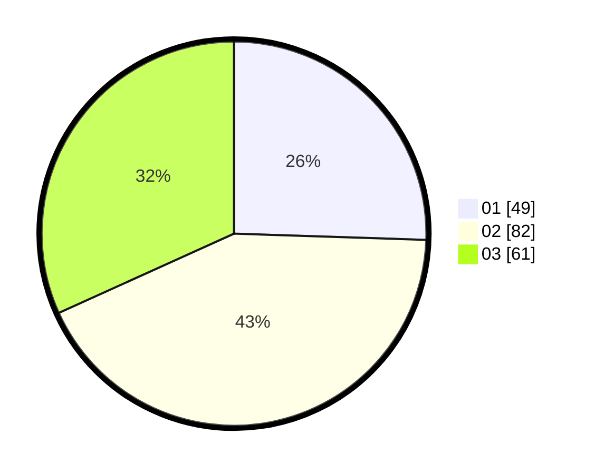

# Hasil

Hasil perolehan suara paslon dapat dilihat pada file paslon-01.txt, paslon-02.txt, dan paslon-03.txt.

Jika tidak ada, artinya data tersebut belum ada pada SIREKAP.

## Perolehan Suara

 * Paslon 01: **49**.
 * Paslon 02: **82**.
 * Paslon 03: **61**.

## Foto C Plano

https://sirekap-obj-formc.kpu.go.id/7885/pemilu/ppwp/31/73/05/10/06/3173051006104-20240214-155114--ac654443-b255-4471-8e9e-6c6a90aaac91.jpg

https://sirekap-obj-formc.kpu.go.id/7885/pemilu/ppwp/31/73/05/10/06/3173051006104-20240214-155307--5429cf9b-9437-4450-9154-f92a3e5539ca.jpg

https://sirekap-obj-formc.kpu.go.id/7885/pemilu/ppwp/31/73/05/10/06/3173051006104-20240214-155446--dc8991a1-328b-4ecb-b809-59ec0382f47c.jpg
