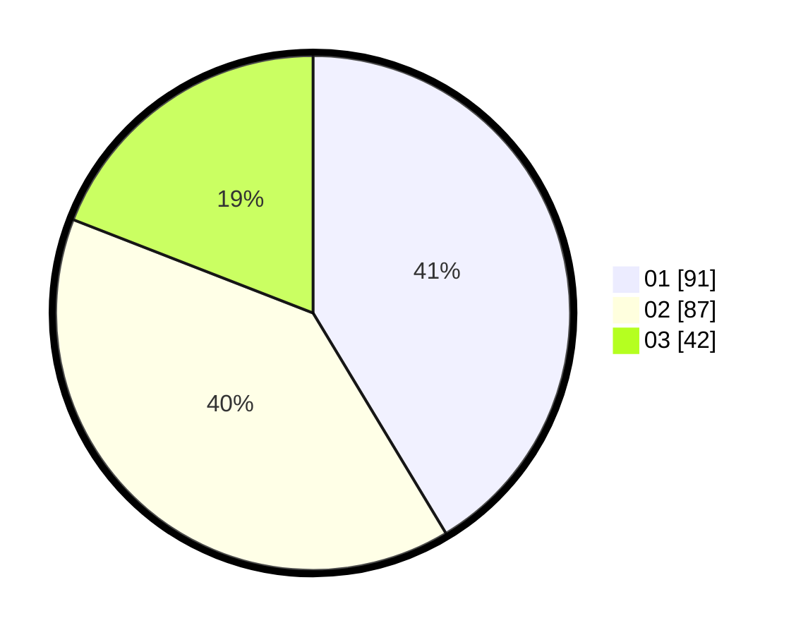

# Hasil

Hasil perolehan suara paslon dapat dilihat pada file paslon-01.txt, paslon-02.txt, dan paslon-03.txt.

Jika tidak ada, artinya data tersebut belum ada pada SIREKAP.

## Perolehan Suara

 * Paslon 01: **91**.
 * Paslon 02: **87**.
 * Paslon 03: **42**.

## Foto C Plano

https://sirekap-obj-formc.kpu.go.id/314c/pemilu/ppwp/31/73/05/10/06/3173051006105-20240216-145024--a031b7ef-ea28-4bcd-bc6b-850c670b5d18.jpg

https://sirekap-obj-formc.kpu.go.id/314c/pemilu/ppwp/31/73/05/10/06/3173051006105-20240215-022617--68f4bd57-88dc-4852-a363-ff0804cc9d8e.jpg

https://sirekap-obj-formc.kpu.go.id/314c/pemilu/ppwp/31/73/05/10/06/3173051006105-20240215-022631--1aba3833-019b-4f78-9740-d4bdf314a749.jpg

## DATA PEMILIH TETAP

Jumlah pemilih dalam DPT: **285**.
 * L: **139**.
 * P: **146**.

## DATA PENGGUNA HAK PILIH

Jumlah pengguna hak pilih dalam DPT: **220**.
 * L: **104**.
 * P: **116**.

Jumlah pengguna hak pilih dalam DPTb: **1**.
 * L: **1**.
 * P: **0**.

Jumlah pengguna hak pilih dalam DPK: **0**.
 * L: **0**.
 * P: **0**.

Jumlah pengguna hak pilih: **221**.
 * L: **105**.
 * P: **116**.

## JUMLAH SUARA SAH DAN TIDAK SAH

JUMLAH SELURUH SUARA SAH: **220**.

JUMLAH SUARA TIDAK SAH: **1**.

JUMLAH SELURUH SUARA SAH DAN SUARA TIDAK SAH: **221**.
