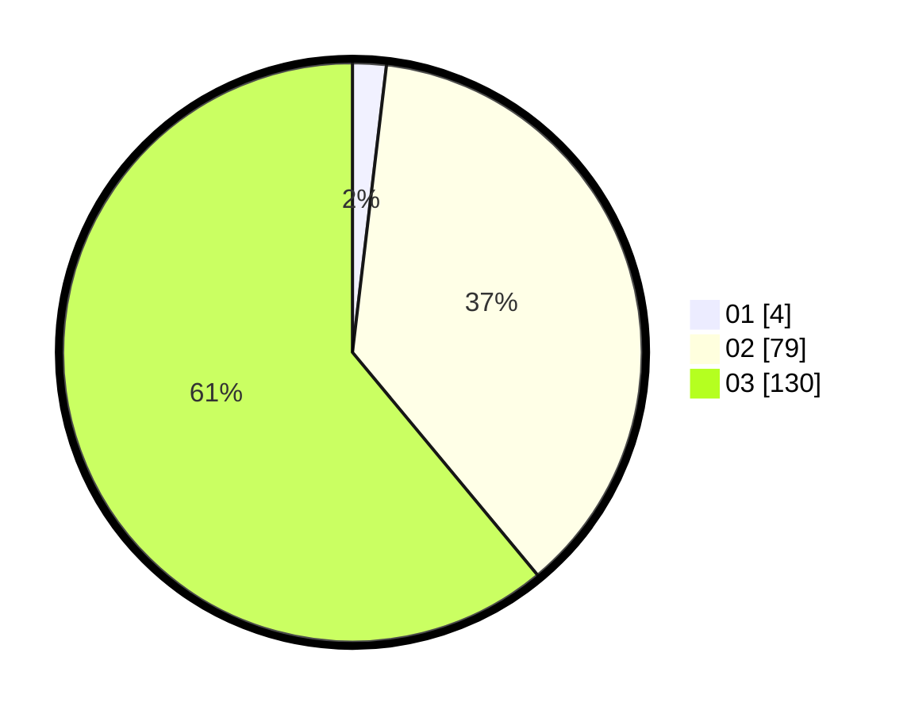

# Hasil

Hasil perolehan suara paslon dapat dilihat pada file paslon-01.txt, paslon-02.txt, dan paslon-03.txt.

Jika tidak ada, artinya data tersebut belum ada pada SIREKAP.

## Perolehan Suara

 * Paslon 01: **4**.
 * Paslon 02: **79**.
 * Paslon 03: **130**.

## Foto C Plano

https://sirekap-obj-formc.kpu.go.id/66ee/pemilu/ppwp/31/73/05/10/06/3173051006109-20240214-211033--8e357c2c-1301-47fe-83bb-52e28da78622.jpg

https://sirekap-obj-formc.kpu.go.id/66ee/pemilu/ppwp/31/73/05/10/06/3173051006109-20240214-211135--fa874224-2ee8-4041-b772-cfc9f9793068.jpg

https://sirekap-obj-formc.kpu.go.id/66ee/pemilu/ppwp/31/73/05/10/06/3173051006109-20240214-211229--3d52a80f-1735-4508-9808-ccc6ca83929a.jpg
